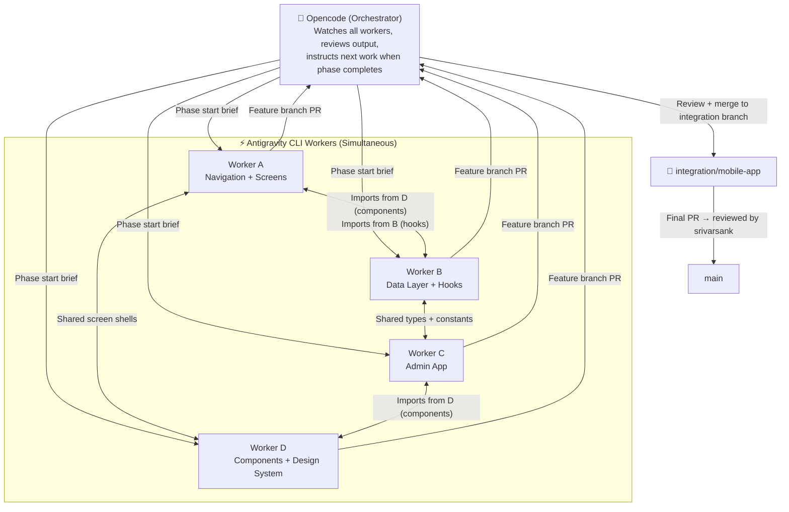
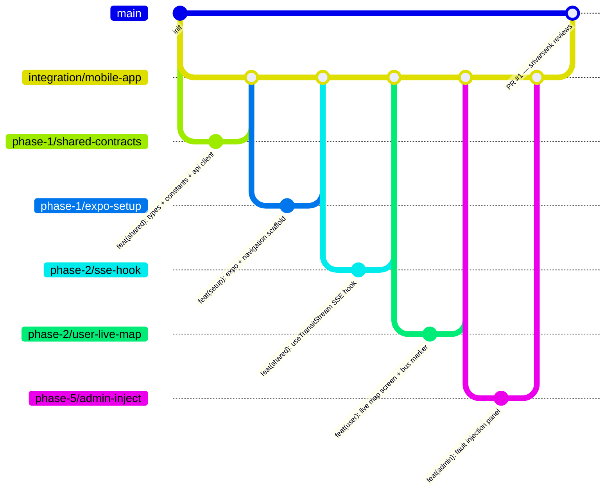
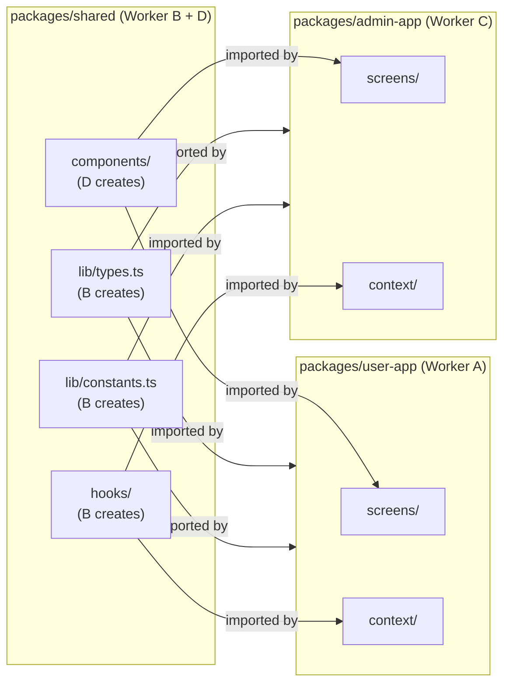

# YARA Mobile — Agent Instructions (ROOT)

> **Read this entire file before writing a single line of code.**
> This file governs the complete agentic workflow for building the YARA mobile app
> in a brand-new React Native repository.

---

## What This Project Is

**YARA** is the Smart India Hackathon (SIH) 2026 public transit intelligence platform.
This repo is the **React Native mobile implementation** — two apps built in a single monorepo:

1. **YARA User App** — Passenger-facing: live ETA map, route search, nearby stops, kiosk mode
2. **YARA Admin App** — Operator/judge-facing: fault injection, fleet control, scenario simulation, Neon DB control

The mobile app is a **pure consumer** of the existing Python backend pipeline:
- CH-1 Simulator: `http://<host>:8001` — fault injection REST API
- CH-3 ETA Engine: `http://<host>:8002` — SSE stream + GTFS REST API
- Neon Postgres — GTFS data (proxied through CH-3)

**All backend services are pre-built and running. Do not modify them.**

---

## Agentic System Architecture



---

## Role Definitions

### 🧠 Orchestrator — Opencode

**Opencode is the orchestrator.** It:

1. **Phases work**: Decides which phase starts, what workers do in parallel
2. **Reviews feature branches**: Checks output quality, API contract correctness, types match
3. **Merges features → integration branch**: Only after reviewing each feature
4. **Blocks next phase**: Workers cannot start Phase N+1 until all Phase N branches are merged to `integration/mobile-app`
5. **Creates the final PR**: `integration/mobile-app` → `main` after all phases complete
6. **Does NOT write code directly**: Only orchestrates, reviews, and merges

**Opencode prompt to start a phase:**
```text
Phase <N> start. Workers: <A|B|C|D>. Task: <description>. Branch: phase-<N>/<feature-name>.
```

### ⚡ Workers — Antigravity CLI

**Antigravity CLI instances are the workers.** Rules:

1. **One worker per feature branch** — never commit to another worker's branch
2. **Read shared contracts first** — always read `lib/types.ts` and `lib/constants.ts` before coding
3. **Never hardcode API URLs** — always import from `lib/constants.ts`
4. **Never modify `lib/types.ts` or `lib/constants.ts` without orchestrator approval** — these are shared contracts
5. **Atomic commits only** — one logical change per commit, Conventional Commits format
6. **Open PR when feature complete** — push branch, open PR targeting `integration/mobile-app`
7. **Never push to `main` directly** — never, ever

---

## Repository Structure (New Repo)

```
yara-mobile/
├── AGENTS.md                       ← This file (copy to new repo)
├── README.md                       ← Quick start guide
├── .env.example                    ← Template for API URLs
├── .gitignore
│
├── packages/
│   ├── user-app/                   ← YARA User App (Expo managed)
│   │   ├── app.json
│   │   ├── package.json
│   │   ├── tsconfig.json
│   │   ├── App.tsx
│   │   ├── src/
│   │   │   ├── navigation/
│   │   │   ├── screens/
│   │   │   ├── components/
│   │   │   ├── hooks/
│   │   │   ├── context/
│   │   │   ├── services/
│   │   │   └── theme/
│   │   └── assets/
│   │
│   └── admin-app/                  ← YARA Admin App (Expo managed)
│       ├── app.json
│       ├── package.json
│       ├── tsconfig.json
│       ├── App.tsx
│       ├── src/
│       │   ├── navigation/
│       │   ├── screens/
│       │   ├── components/
│       │   ├── hooks/
│       │   ├── context/
│       │   └── services/
│       └── assets/
│
├── packages/shared/                ← Shared types, constants, hooks, components
│   ├── package.json
│   ├── lib/
│   │   ├── types.ts                ← 🔒 LOCKED: all TypeScript interfaces
│   │   ├── constants.ts            ← 🔒 LOCKED: API URLs, numeric constants
│   │   └── agencies.ts             ← Agency presets data
│   ├── hooks/
│   │   ├── useTransitStream.ts     ← SSE consumer (shared)
│   │   └── useNeonRoutes.ts        ← REST client (shared)
│   ├── components/                 ← Shared UI primitives
│   │   ├── OccupancyBadge.tsx
│   │   ├── ETACountdown.tsx
│   │   ├── LiveSignalIcon.tsx
│   │   ├── TripTimeline.tsx
│   │   └── ETABreakdownBar.tsx
│   └── services/
│       ├── api.ts                  ← REST client
│       └── sse.ts                  ← SSE connection manager
│
└── docs/
    ├── PRD.md
    ├── ARCHITECTURE.md
    ├── DESIGN.md
    └── TECH_STACK.md
```

> **Monorepo tooling**: Use `npm workspaces`. Each package imports shared via
> `@yara/shared` alias configured in `tsconfig.json`.

---

## 🔒 Locked Shared Contracts

These files live in `packages/shared/lib/`. **No worker may modify them without orchestrator approval.** They are the source of truth for all API contracts.

### `constants.ts`

```typescript
// packages/shared/lib/constants.ts
// Mirror of Python shared/constants.py — LOCKED

// Backend URLs — set via environment variables
export const API_BASE_URL = process.env.EXPO_PUBLIC_API_URL ?? 'http://192.168.1.100:8002';
export const SIM_BASE_URL = process.env.EXPO_PUBLIC_SIM_URL ?? 'http://192.168.1.100:8001';

// Transit constants (from shared/constants.py)
export const BLOCK_ID             = 'block_001';
export const BUS_CAPACITY         = 40;       // seated
export const BUS_MAX_CAPACITY     = 55;       // absolute max
export const OUTBOUND_TOTAL_SEC   = 25 * 60;  // 1500s
export const INBOUND_TOTAL_SEC    = 25 * 60;  // 1500s
export const DWELL_BASELINE_SEC   = 300;
export const DWELL_RECOVERY_FACTOR = 0.3;
export const DWELL_MINIMUM_SEC    = 60;
export const BAND_MODERATE_RATIO  = 1.2;

// SSE
export const SSE_RECONNECT_DELAY_MS      = 3000;
export const SSE_MAX_RECONNECT_ATTEMPTS  = 5;
```

### `types.ts` — Key Interfaces

```typescript
// packages/shared/lib/types.ts — LOCKED

export type OccupancyBand =
  | 'SEATS_AVAILABLE'
  | 'MODERATE'
  | 'STANDING_ROOM'
  | 'VERY_CROWDED';

export type BusLeg = 'outbound' | 'dwell' | 'inbound';
export type ETAMode = 'ml' | 'calculative';
export type GNSSSource = 'gnss' | 'kalman_estimated';
export type LegState = 'EN_ROUTE' | 'DWELL' | 'HOLD';

// SSE payload from GET /stream
export interface TransitSnapshot { /* see docs/ARCHITECTURE.md */ }

// REST payloads from /api/routes, /api/stops
export interface NeonRoute { /* see docs/ARCHITECTURE.md */ }
export interface NeonStop  { /* see docs/ARCHITECTURE.md */ }
export interface BusArrival { /* see docs/ARCHITECTURE.md */ }

// Fault injection payloads
export interface DelayRequest    { seconds: number }
export interface DropoutRequest  { duration_s: number }
export interface CrowdSpikeRequest { band: string; duration_s: number }

// Simulator vehicle telemetry (from GET /vehicles)
export interface VehicleTelemetry {
  vehicle_id: string;
  block_id: string;
  trip_id: string;
  route_id: string;
  direction: 'outbound' | 'inbound';
  leg_state: LegState;
  timestamp: string;
  lat: number;
  lon: number;
  bearing_deg: number;
  speed_kmh: number;
  distance_covered_m: number;
  leg_total_distance_m: number;
  percent_leg_complete: number;
  eta_leg_end_s: number | null;
  dwell_remaining_s: number | null;
  hold_remaining_s: number;
  schedule_deviation_s: number;
  gnss_fix: boolean;
  gnss_dropout_remaining_s: number;
  occupancy_band: string;
  crowd_spike_active: boolean;
}
```

---

## Git Branching Strategy



### Branch Naming Rules

| Branch Type | Pattern | Example |
|---|---|---|
| Feature | `phase-<N>/<app>-<feature>` | `phase-2/user-live-map` |
| Shared work | `phase-<N>/shared-<feature>` | `phase-1/shared-contracts` |
| Integration | `integration/mobile-app` | (single, permanent) |
| Hotfix | `hotfix/<description>` | `hotfix/sse-reconnect` |

### PR Rules

| PR Type | Target Branch | Reviewer | Merge Condition |
|---|---|---|---|
| Feature → Integration | `integration/mobile-app` | **Orchestrator (Opencode)** | Orchestrator approves |
| Integration → Main | `main` | **srivarsank** | srivarsank approves |
| Hotfix → Integration | `integration/mobile-app` | Orchestrator | Orchestrator approves |

> ⚠️ **NEVER open a feature branch PR directly to `main`.**
> All work flows: `feature branch` → `integration/mobile-app` → `main`.

### Commit Format

```
feat(user): add live map screen with animated bus marker
fix(shared): handle SSE reconnect race condition
feat(admin): add fault injection panel with vehicle selector
refactor(shared): split useNeonRoutes into smaller hooks
chore(setup): configure expo monorepo workspaces
```

Scope prefixes:
- `user` — YARA User App
- `admin` — YARA Admin App
- `shared` — shared package
- `setup` — repo scaffold, config files

---

## Phase Plan — Complete Build Sequence

### Phase 0 — Repository Bootstrap (Orchestrator executes)

**Who**: Orchestrator (Opencode) runs these commands directly.
**Goal**: Create repo scaffold, install tools, configure workspaces.

```bash
# Create monorepo
mkdir yara-mobile && cd yara-mobile
git init
git checkout -b integration/mobile-app

# Root package.json (workspaces)
cat > package.json << 'EOF'
{
  "name": "yara-mobile",
  "private": true,
  "workspaces": ["packages/*"]
}
EOF

# Create app scaffolds
mkdir -p packages/shared/lib packages/shared/hooks packages/shared/components packages/shared/services
mkdir -p packages/user-app packages/admin-app
mkdir -p docs

# Bootstrap each app
cd packages/user-app
npx -y create-expo-app@latest ./ --template blank-typescript
cd ../admin-app
npx -y create-expo-app@latest ./ --template blank-typescript
cd ../..

# Commit scaffold
git add .
git commit -m "chore(setup): initialize monorepo with user-app + admin-app"
```

---

### Phase 1 — Foundation (ALL Workers in parallel)

**Orchestrator brief**: "Phase 1 start. Create feature branches. Workers work simultaneously. Phase 1 unlocks Phase 2."

**Gate**: All 4 Phase 1 branches merged to `integration/mobile-app` before Phase 2 begins.

---

#### Worker B — `phase-1/shared-contracts`

**Scope**: `packages/shared/`

**Tasks** (in order):
1. Create `lib/constants.ts` with all values from `shared/constants.py`
2. Create `lib/types.ts` with all TypeScript interfaces (TransitSnapshot, NeonRoute, NeonStop, VehicleTelemetry, etc.)
3. Create `lib/agencies.ts` — port `dashboard/src/lib/agencies.ts` exactly
4. Create `services/api.ts` — REST client wrapping all CH-3 + CH-1 endpoints
5. Create `services/sse.ts` — SSE connection manager class
6. Configure `package.json` with name `@yara/shared` and peer deps

**Acceptance criteria**:
- `constants.ts` imports cleanly, all values match `shared/constants.py`
- `types.ts` has zero `any` types
- `api.ts` covers every endpoint from `eta_engine/api.py` and `simulator/control_api.py`
- All files pass `tsc --noEmit`

---

#### Worker D — `phase-1/shared-components`

**Scope**: `packages/shared/components/`

**Depends on**: Worker B completing `types.ts` first (coordinate via orchestrator)

**Tasks** (in order):
1. `OccupancyBadge.tsx` — port from `dashboard/src/components/OccupancyBadge.tsx`
   - Props: `band: OccupancyBand`, `size?: 'sm' | 'md' | 'lg'`
   - Colors: SEATS_AVAILABLE=`#22C55E`, MODERATE=`#EAB308`, STANDING_ROOM=`#F97316`, VERY_CROWDED=`#EF4444`
2. `ETACountdown.tsx` — port from `dashboard/src/components/ETACountdown.tsx`
   - Props: `seconds: number`, `isConnected: boolean`
   - MM:SS monospace display, ticks via `useCountdown` hook internally
3. `LiveSignalIcon.tsx` — pulsing WiFi-arc indicator
   - Props: `isConnected: boolean`
4. `TripTimeline.tsx` — vertical step: Outbound → Dwell → Inbound
   - Props: `leg: BusLeg`, `progress: number`
5. `ETABreakdownBar.tsx` — horizontal stacked bar
   - Props: `tOut: number`, `tDwell: number`, `tIn: number`
6. `theme/colors.ts`, `theme/typography.ts`, `theme/spacing.ts`

---

#### Worker A — `phase-1/user-app-scaffold`

**Scope**: `packages/user-app/`

**Depends on**: Worker B (`types.ts` and `constants.ts`) must exist

**Tasks**:
1. Install all dependencies:
   ```bash
   npx expo install react-native-screens react-native-safe-area-context
   npm install @react-navigation/native @react-navigation/bottom-tabs @react-navigation/native-stack
   npx expo install react-native-maps react-native-reanimated react-native-gesture-handler
   npm install @gorhom/bottom-sheet react-native-sse lucide-react-native
   npx expo install react-native-svg expo-location expo-keep-awake
   ```
2. Configure `tsconfig.json` with `@yara/shared` path alias
3. Create `src/navigation/RootNavigator.tsx` — Stack: Tabs + KioskScreen + AdminScreen modal
4. Create `src/navigation/TabNavigator.tsx` — 5 tabs: Overview, Map, Track, Routes, Search
5. Create `src/navigation/types.ts` — all navigation param types
6. Create stub screen files (empty screens with placeholder text):
   - `OverviewScreen.tsx`, `LiveMapScreen.tsx`, `TrackBusScreen.tsx`
   - `RoutesScreen.tsx`, `SearchScreen.tsx`, `RouteDetailScreen.tsx`
   - `KioskScreen.tsx`, `AdminScreen.tsx`
7. Create `context/TransitContext.tsx` — provider wrapping `useTransitStream`
8. Create `context/RoutesContext.tsx` — provider wrapping `useNeonRoutes`
9. Wire `App.tsx` with providers + navigator

---

#### Worker C — `phase-1/admin-app-scaffold`

**Scope**: `packages/admin-app/`

**Depends on**: Worker B (`types.ts`) must exist

**Tasks**:
1. Install dependencies (same as user-app)
2. Configure `tsconfig.json` with `@yara/shared` path alias
3. Create `src/navigation/AdminNavigator.tsx` — Stack navigator
4. Create stub screens:
   - `DashboardScreen.tsx` — fleet overview
   - `InjectScreen.tsx` — fault injection panel
   - `FleetScreen.tsx` — vehicle list + telemetry
   - `ScenarioScreen.tsx` — pre-built scenario runner
   - `DatabaseScreen.tsx` — Neon DB inspector
5. Create `context/AdminContext.tsx` — vehicle list state, inject history
6. Wire `App.tsx`

---

### Phase 2 — User App Core (Workers A + B in parallel, D supports)

**Gate for start**: All Phase 1 branches merged to integration.
**Gate for end**: All Phase 2 branches merged to integration.

---

#### Worker B — `phase-2/sse-hook`

**Scope**: `packages/shared/hooks/`

**Tasks**:
1. `useTransitStream.ts` — port from `dashboard/src/lib/useTransitStream.ts`
   - Replace browser `EventSource` with `react-native-sse`
   - Same reconnect logic: 3s delay, 5 max attempts, mock fallback
   - Export same interface: `{ data: TransitSnapshot, isConnected: boolean }`
2. `useNeonRoutes.ts` — port from `dashboard/src/lib/useNeonRoutes.ts`
   - `fetch` API works natively in React Native — nearly direct port
   - Cache stops in `useRef<Record<string, NeonStop[]>>`
   - Export same interface as web hook
3. `useLocation.ts` — GPS wrapper using `expo-location`
   - Request foreground permission on mount
   - Returns `{ lat, lon, error, loading }`
4. `useCountdown.ts` — timer tick helper for ETA countdown

---

#### Worker A — `phase-2/user-live-map`

**Scope**: `packages/user-app/src/screens/LiveMapScreen.tsx`

**Depends on**: Worker B's `useTransitStream.ts` merged

**Tasks**:
1. MapView centered on Chennai (13.0302, 80.1806), zoom 12
2. `BusMarker` component — animated lat/lon interpolation (1000ms `withTiming`)
   - Desaturated (opacity 0.6) when `vehicle.leg === 'outbound'`
   - Full blue `#2563EB` when `vehicle.leg === 'inbound'`
   - Amber pulsing when `vehicle.leg === 'dwell'`
3. Route polyline overlay (hardcoded Chennai corridor from agencies.ts)
4. `@gorhom/bottom-sheet` with 3 snap points: `['30%', '60%', '90%']`
   - Bottom sheet contents:
     - `ETACountdown` (seconds from `data.inbound.T_total_sec`)
     - `ETABreakdownBar` (T_out, T_dwell, T_in)
     - `OccupancyBadge` (from `data.inbound.occupancy_band`)
     - Bus leg state label: "Completing outbound → Arriving on return"
     - `LiveSignalIcon` in top-right of sheet
5. Connection status indicator in header
6. Agency selector dropdown (from `agencies.ts`)

---

#### Worker D — `phase-2/user-overview`

**Scope**: `packages/user-app/src/screens/OverviewScreen.tsx`

**Tasks**: Port `ProjectLandingHome.tsx` (396 lines from web) to React Native:
1. Yara logo hero (use SVG from `assets/`)
2. Pipeline status indicators — 3 cards: SIM/KAL/ETA — green/red based on SSE `isConnected`
3. Feature highlights 2×2 grid:
   - Live ETA (ML-powered), Density (4-band), Kalman Filter, Kiosk Display
4. "Launch Live Dashboard" button → navigates to LiveMapScreen
5. Hackathon demo blurb with animated background
6. Animated entrance: cards fade in staggered via `react-native-reanimated`

---

### Phase 3 — User App Routes & Search (Workers A + B in parallel)

**Gate for start**: Phase 2 merged to integration.

---

#### Worker B — `phase-3/routes-context`

**Scope**: `packages/user-app/src/context/RoutesContext.tsx`

**Tasks**:
1. Implement full `RoutesContext` backed by `useNeonRoutes`
2. Expose: `routes`, `totalPages`, `fetchRoutes(page)`, `searchRoutes(q)`, `fetchStopsForRoute(id, dir)`, `searchStops(q)`, `fetchNearbyStops(lat, lon)`, `nearbyStops`, `stopsCache`
3. GPS auto-fetch nearby stops on mount (via `useLocation`)
4. Cache stops in context to avoid repeated API calls

---

#### Worker A — `phase-3/user-routes-screens`

**Scope**: `packages/user-app/src/screens/RoutesScreen.tsx`, `RouteDetailScreen.tsx`, `SearchScreen.tsx`

**Depends on**: Worker B Phase 3 branch merged

**Tasks**:
1. **RoutesScreen**: `FlatList` of `RouteCard` components
   - Pagination via `onEndReached` → `fetchRoutes(nextPage)`
   - Pull-to-refresh
   - Agency filter chips
2. **SearchScreen**: `SearchView` port
   - TextInput with debounce (300ms)
   - Toggle: Routes / Stops
   - Search results `FlatList` with route cards + stop cards
   - Tap route → navigate to `RouteDetailScreen`
   - `SearchAutocomplete` suggestions while typing
3. **RouteDetailScreen**: `RouteDetailView` port
   - MapView with stop markers + connecting polyline
   - Segment control: Outbound / Return (direction_id 0/1)
   - `FlatList` of stops with stop name + arrival time
   - Stop tap → show upcoming buses at that stop (modal)

**Route/Stop Card designs** (from DESIGN.md):
- Route card: bus icon, code bold, name, stops·duration·fare row
- Stop card: pin icon, name, distance, walk time, bus list

---

#### Worker D — `phase-3/shared-search-components`

**Scope**: `packages/shared/components/`

**Tasks**:
1. `RouteCard.tsx` — route list item (shared between user + admin)
2. `StopCard.tsx` — stop item with bus arrival list
3. `SearchInput.tsx` — styled TextInput with clear button + debounce hook
4. `EmptyState.tsx` — "No results" illustration + message
5. `LoadingShimmer.tsx` — skeleton loading cards

---

### Phase 4 — Kiosk Mode (Worker A)

**Gate for start**: Phase 3 merged to integration.

---

#### Worker A — `phase-4/user-kiosk`

**Scope**: `packages/user-app/src/screens/KioskScreen.tsx`

**Tasks**: Port `KioskDisplayView.tsx` (18231 bytes) to fullscreen React Native:
1. `expo-keep-awake` — prevent screen sleep
2. `StatusBar` hidden, fullscreen layout
3. Force landscape on tablet via `expo-screen-orientation`
4. Large `ETACountdown` — 72px monospace font
5. Large `OccupancyBadge` — 24px text
6. `ETABreakdownBar` — full width
7. Event log: last 5 entries, auto-scroll to latest
8. Auto-refresh from `TransitContext` SSE data
9. Yara branding footer
10. High-contrast mode: white text on `#0F172A` dark background

---

### Phase 5 — Admin App Core (Worker C)

**Gate for start**: Phase 1 merged to integration (admin can start parallel to Phase 2/3/4).

---

#### Worker C — `phase-5/admin-fault-injection`

**Scope**: `packages/admin-app/src/screens/InjectScreen.tsx`

**Tasks**: Port `AdminPanel.tsx` (24788 bytes) + `InjectPanel.tsx` to admin app:
1. Vehicle selector — dropdown `BUS-001` through `BUS-004` (fetched from `GET /vehicles`)
2. Three inject buttons:
   - **⚠️ Inject Delay (+5 min)** → `POST /vehicles/{id}/delay` with `{ seconds: 300 }`
   - **📡 GNSS Dropout (10s)** → `POST /vehicles/{id}/gnss-dropout` with `{ duration_s: 10 }`
   - **👥 Crowd Spike (30s)** → `POST /vehicles/{id}/crowd-spike` with `{ band: "STANDING_ROOM_ONLY", duration_s: 30 }`
3. Custom inject controls (sliders for seconds, dropdown for band)
4. `EventLog` component — real-time log from SSE `event_log` array
5. Inject response toast: "Delay injected — ETA updating..." with 2s timeout
6. Pipeline health status bar (SIM/KAL/ETA green/red)

---

#### Worker C — `phase-5/admin-fleet`

**Scope**: `packages/admin-app/src/screens/FleetScreen.tsx`

**Tasks**:
1. `GET /vehicles` — list all 4 vehicles with full `VehicleTelemetry`
2. Vehicle card per bus: ID, leg state badge, speed, occupancy band, progress bar
3. Tap vehicle → vehicle detail:
   - Real-time position map
   - All telemetry fields
   - Hold/dwell countdown timers
   - GNSS fix status indicator
4. Auto-refresh every 2s via `setInterval` polling `GET /vehicles/{id}`

---

### Phase 6 — Admin App Advanced (Worker C)

**Gate for start**: Phase 5 merged to integration.

---

#### Worker C — `phase-6/admin-scenarios`

**Scope**: `packages/admin-app/src/screens/ScenarioScreen.tsx`

**Tasks**: Pre-built demo scenario runner (for judge demo):
1. **Scenario: 90-Second Judge Demo**
   - Auto-executes the standard hackathon demo sequence:
     1. Wait 10s (observe baseline)
     2. Inject Delay +5min on BUS-001
     3. Wait 5s
     4. Inject GNSS Dropout 10s on BUS-001
     5. Wait 5s
     6. Inject Crowd Spike 30s on BUS-001
   - Progress bar shows scenario execution stage
   - Live event log updates in real-time
2. **Scenario: Stress Test** — inject all 3 faults simultaneously
3. **Scenario: Recovery** — inject delay then watch dwell shrink (recovery factor demo)
4. Start/Pause/Reset controls
5. Scenario status: "Running... Stage 2/4"

---

#### Worker C — `phase-6/admin-database`

**Scope**: `packages/admin-app/src/screens/DatabaseScreen.tsx`

**Tasks**: Neon DB inspector via CH-3 REST API:
1. **Routes tab**: Paginated route list, total count, search by code
2. **Stops tab**: Stop search, tap to see details + nearby buses
3. **Live State tab**: Current `GET /eta` snapshot — all fields displayed as JSON inspector
4. **Model Info tab**: `GET /model/info` — ML model metadata (MAE, R², training size)
5. **Network Stats tab**: `GET /routes` — GTFS-derived statistics
6. Copy-to-clipboard for any value
7. Raw JSON toggle (show formatted vs raw)

---

### Phase 7 — Polish & Integration (All Workers)

**Gate for start**: Phases 2–6 all merged to integration.

---

#### Worker D — `phase-7/animations-polish`

**Tasks**:
1. Bus marker smooth interpolation (verify 60fps on physical device)
2. Screen transition animations (fade for tabs, slide for stack)
3. Occupancy badge change animation (color crossfade + scale pulse)
4. Bottom sheet spring physics tuning
5. Overview screen staggered card entrance
6. Micro-interaction: inject button ripple + confirmation shake

---

#### Worker A — `phase-7/user-track-bus`

**Scope**: `packages/user-app/src/screens/TrackBusScreen.tsx`

**Tasks**: Port `ChaloHomeView.tsx` Track tab:
1. `TripTimeline` — full-width vertical step timeline
2. Speed gauge + bearing indicator
3. GNSS fix status badge
4. ETA breakdown with live ticking
5. Event log feed (last 10 entries from SSE)

---

#### Worker B — `phase-7/offline-resilience`

**Tasks**:
1. Mock data fallback after 5 SSE failures (matches web behavior)
2. `AsyncStorage` cache for last-known routes (load on mount before API responds)
3. `AsyncStorage` cache for recently searched routes
4. Stale data warning banner: "Data from 30s ago — reconnecting..."
5. Retry button when in mock fallback state

---

#### Worker C — `phase-7/admin-dark-mode`

**Tasks**:
1. Dark mode for admin app: `#0F172A` backgrounds, `#F8FAFC` text
2. Map dark tiles: CartoDB Dark Matter URL
3. `useColorScheme` React Native hook for auto-detection

---

### Phase 8 — Final Integration PR (Orchestrator)

**Who**: Orchestrator (Opencode) only.

1. Verify all phase branches are merged to `integration/mobile-app`
2. Run `tsc --noEmit` in all packages — must pass clean
3. Verify SSE + REST contracts match backend (test against live CH-3)
4. Verify fault injection works end-to-end
5. Create final PR: `integration/mobile-app` → `main`
6. PR description includes:
   - Phase completion checklist
   - Demo video link
   - Known limitations
7. **Tag srivarsank as reviewer — only they can merge**

---

## Worker-to-Worker Data Exchange

Workers run simultaneously but share contracts. Here is how data flows:



**Rule**: Workers A and C must NEVER create their own type definitions. They import exclusively from `@yara/shared`.

---

## Orchestrator Phase Control Protocol

After each phase, Opencode:

1. **Reviews feature branches** in sequence:
   - Read the diff on GitHub/Gitea
   - Verify: types used correctly, no hardcoded URLs, no `any`, atomic commits
   - Approve or request changes

2. **Merges to integration branch**:
   ```bash
   git checkout integration/mobile-app
   git merge phase-N/feature-name --no-ff
   git push origin integration/mobile-app
   ```

3. **Broadcasts next phase brief to workers**:
   ```
   Phase N+1 start.
   Worker A: branch phase-N+1/user-X. Task: [description].
   Worker B: branch phase-N+1/shared-Y. Task: [description].
   Worker C: branch phase-N+1/admin-Z. Task: [description].
   Worker D: branch phase-N+1/shared-W. Task: [description].
   Gate: All Phase N branches must be in integration/mobile-app before start.
   ```

4. **Verifies sync** before Phase 2+ starts:
   ```bash
   git log integration/mobile-app --oneline | grep "phase-1"
   # Must see: phase-1/shared-contracts, phase-1/shared-components,
   #           phase-1/user-app-scaffold, phase-1/admin-app-scaffold
   ```

---

## Demo Success Criteria (Judge Evaluation)

From the parent repo's `AGENTS.md` — the mobile app must pass all of these on a physical device:

- [ ] Bus visible on map moving in real-time
- [ ] Outbound bus shows "Completing prior route" with live inbound ETA
- [ ] Inject Delay (Admin App) → User App countdown jumps within 2s
- [ ] Inject Dropout (Admin App) → User App map path stays smooth (no teleport)
- [ ] Inject Crowd (Admin App) → User App occupancy badge changes
- [ ] Event log shows cause → effect from single button press
- [ ] All four numbers change from one inject (pipeline is connected)
- [ ] Works on physical Android AND iOS device

---

## Bootstrap Instructions for New Repo

Copy this entire `AGENTS.md` file into the root of the new `yara-mobile` repository.
Then follow this exact sequence:

```bash
# 1. Create repo on GitHub as 'yara-mobile' (done manually by srivarsank)
# 2. Clone locally
git clone https://github.com/SrivarsanK/yara-mobile.git
cd yara-mobile

# 3. Create integration branch immediately — never work on main
git checkout -b integration/mobile-app
git push -u origin integration/mobile-app

# 4. Copy docs from parent repo
cp -r ../SIH-inthack-2026/mobile-app/. ./docs/

# 5. Set branch protection rules on GitHub:
#    - main: require PR, require review from srivarsank, no direct push
#    - integration/mobile-app: require PR from feature branches (optional)

# 6. Give Orchestrator (Opencode) this prompt:
#    "Phase 0 start. Bootstrap the yara-mobile monorepo. Read AGENTS.md."
```

---

## Key Files for Each Worker to Read Before Starting

| Worker | Files to read first |
|---|---|
| **All** | `AGENTS.md` (this file), `docs/ARCHITECTURE.md`, `docs/PRD.md` |
| **Worker A** | `docs/DESIGN.md` (screens), parent repo `dashboard/src/components/ChaloHomeView.tsx` |
| **Worker B** | `docs/ARCHITECTURE.md` (contracts), parent repo `eta_engine/api.py`, `simulator/control_api.py`, `shared/constants.py` |
| **Worker C** | `docs/PRD.md` (Admin App section), parent repo `dashboard/src/components/AdminPanel.tsx` |
| **Worker D** | `docs/DESIGN.md` (full), parent repo `dashboard/src/components/OccupancyBadge.tsx`, `ETACountdown.tsx` |

---

## Reference: Backend API Quick Reference

### CH-3 ETA Engine (`http://<host>:8002`)

| Method | Endpoint | Response |
|---|---|---|
| GET | `/stream` | SSE: `TransitSnapshot` every 1s |
| GET | `/eta` | One-shot `TransitSnapshot` |
| GET | `/api/routes?page=1&limit=50` | Paginated routes |
| GET | `/api/routes/search?q=S26` | Route search (returns both directions) |
| GET | `/api/routes/{id}/stops?direction=0` | Ordered stops |
| GET | `/api/stops/search?q=broadway` | Stop name search |
| GET | `/api/stops/nearby?lat=13.03&lon=80.18&limit=5` | Nearest stops + buses |
| GET | `/model/info` | ML model metadata |
| GET | `/routes` | GTFS network stats |

### CH-1 Simulator (`http://<host>:8001`)

| Method | Endpoint | Body | Response |
|---|---|---|---|
| GET | `/health` | — | `{ status, vehicle_count, block_count }` |
| GET | `/vehicles` | — | `VehicleTelemetry[]` |
| GET | `/vehicles/{id}` | — | `VehicleTelemetry` |
| GET | `/blocks` | — | Block + leg chain |
| POST | `/vehicles/{id}/delay` | `{ seconds: 300 }` | `VehicleTelemetry` |
| POST | `/vehicles/{id}/gnss-dropout` | `{ duration_s: 10 }` | `VehicleTelemetry` |
| POST | `/vehicles/{id}/crowd-spike` | `{ band: "STANDING_ROOM_ONLY", duration_s: 30 }` | `VehicleTelemetry` |
