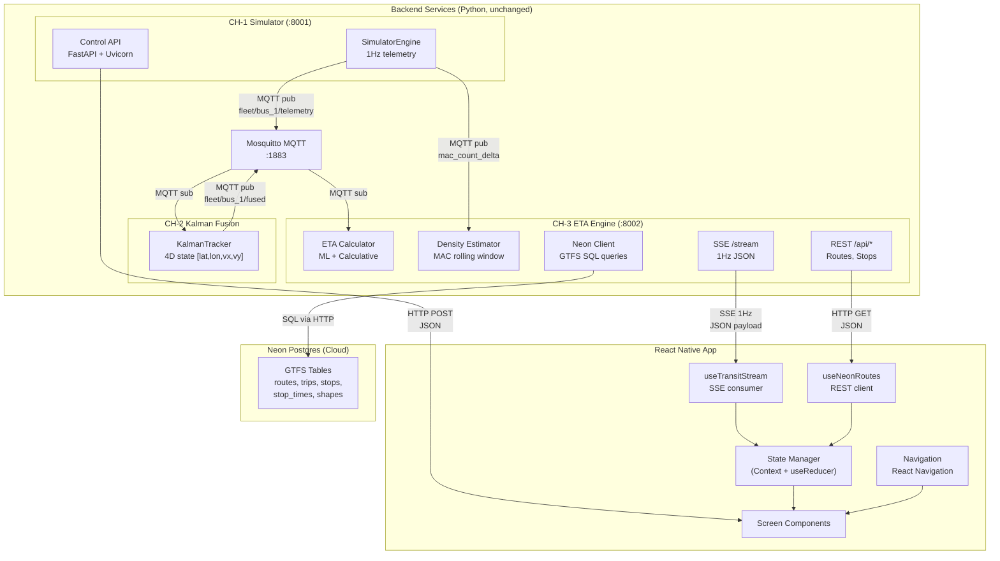
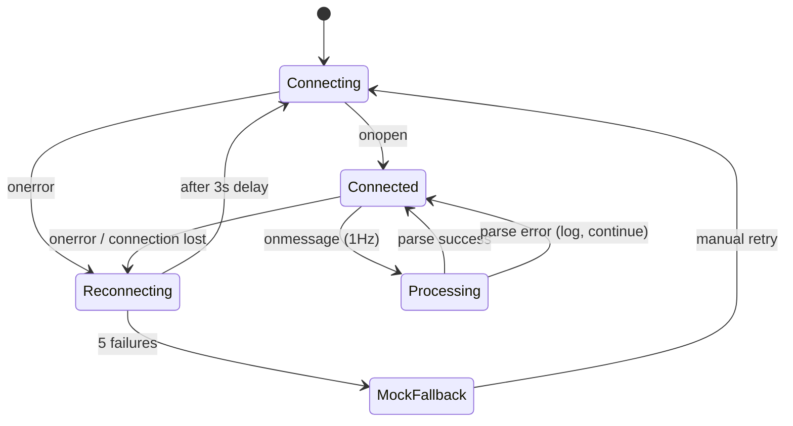
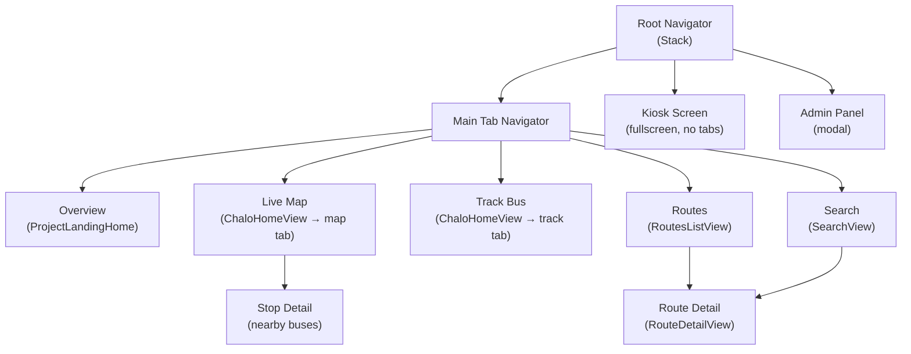

# YARA Mobile — Architecture Document

> System architecture for the React Native mobile app, mapping every backend service,
> data flow, and communication protocol from the existing Python pipeline.

---

## 1. System Context

The Yara mobile app is a **pure consumer** of the existing 4-channel backend pipeline. It replaces only CH-4 (the Astro.js web dashboard). The backend services (CH-1 Simulator, CH-2 Kalman, CH-3 ETA Engine) remain unchanged.



---

## 2. Network Architecture

### 2.1 Endpoints the Mobile App Consumes

| Service | Base URL | Protocol | Purpose |
|---|---|---|---|
| **CH-3 ETA Engine** | `http://<host>:8002` | SSE + REST | Live telemetry stream + GTFS route data |
| **CH-1 Simulator** | `http://<host>:8001` | REST (POST) | Fault injection (judge demo only) |
| **Neon Postgres** | Proxied through CH-3 | SQL-over-HTTP | GTFS tables (routes, stops, stop_times) |

### 2.2 SSE Connection Lifecycle



### 2.3 Request/Response Contracts

#### SSE Stream (`GET /stream`)
- **Content-Type**: `text/event-stream`
- **Payload**: `data: {TransitSnapshot JSON}\n\n` every 1 second
- **Reconnect**: Client-side (no `retry:` header from server)

#### REST Routes API (`GET /api/routes`)
```json
{
  "routes": [
    {
      "route_id": "13311",
      "route_short_name": "S26",
      "route_long_name": "Ashok Pillar TO Valasaravakkam",
      "route_type": 3,
      "agency_id": 69,
      "origin": "Ashok Pillar",
      "destination": "Valasaravakkam"
    }
  ],
  "total": 542,
  "page": 1,
  "limit": 50,
  "pages": 11
}
```

#### REST Nearby Stops (`GET /api/stops/nearby?lat=13.03&lon=80.18&limit=5`)
```json
{
  "stops": [
    {
      "stop_id": "123",
      "stop_name": "Ashok Pillar",
      "stop_lat": 13.0351,
      "stop_lon": 80.2108,
      "distance_km": "0.32",
      "walk_min": 4,
      "buses": [
        {
          "route_id": "13311-dir0",
          "code": "S26",
          "destination": "Valasaravakkam",
          "eta_min": 6,
          "eta_time": "11:23 PM"
        }
      ]
    }
  ]
}
```

#### Fault Injection (`POST /vehicles/{id}/delay`)
```json
// Request
{ "seconds": 300 }

// Response: Full VehicleTelemetry snapshot
{
  "vehicle_id": "BUS-001",
  "block_id": "BLOCK-1",
  "trip_id": "R1-OUT-1",
  "route_id": "R1",
  "direction": "outbound",
  "leg_state": "HOLD",
  "lat": 13.0878,
  "lon": 80.2785,
  "speed_kmh": 0.0,
  "hold_remaining_s": 300.0,
  "schedule_deviation_s": 300,
  "occupancy_band": "FEW_SEATS_AVAILABLE",
  ...
}
```

---

## 3. Mobile App Internal Architecture

### 3.1 Layer Diagram

```
┌─────────────────────────────────────────────────┐
│                  Presentation                    │
│  Screens: Overview, LiveMap, TrackBus,           │
│           Routes, Search, Kiosk, Admin           │
├─────────────────────────────────────────────────┤
│                  Navigation                      │
│  React Navigation (Tab + Stack)                  │
├─────────────────────────────────────────────────┤
│                  State Layer                     │
│  React Context + useReducer                      │
│  TransitContext (SSE data, connection status)     │
│  RoutesContext (Neon DB routes, stops, cache)     │
├─────────────────────────────────────────────────┤
│                  Data Hooks                       │
│  useTransitStream (SSE)                          │
│  useNeonRoutes (REST)                            │
│  useLocation (GPS)                               │
├─────────────────────────────────────────────────┤
│                  Services                        │
│  SSEClient (EventSource polyfill)                │
│  ApiClient (fetch wrapper)                       │
│  LocationService (Geolocation API)               │
├─────────────────────────────────────────────────┤
│                  Platform                        │
│  react-native-maps / MapLibre                    │
│  react-native-reanimated (animations)            │
│  expo-location (GPS)                             │
└─────────────────────────────────────────────────┘
```

### 3.2 Navigation Structure



### 3.3 State Management

```typescript
// TransitContext — wraps SSE data
interface TransitState {
  snapshot: TransitSnapshot;      // Latest SSE payload
  isConnected: boolean;           // SSE connection status
  eventLog: EventLogEntry[];      // Accumulated events
  connectionAttempts: number;
}

// RoutesContext — wraps Neon DB data
interface RoutesState {
  routes: NeonRoute[];            // Paginated route list
  totalRoutes: number;
  currentPage: number;
  searchResults: NeonRoute[];
  stopSearchResults: NeonStop[];
  nearbyStops: NeonStop[];
  stopsCache: Record<string, NeonStop[]>;  // routeId → stops
  isLoading: boolean;
}
```

---

## 4. Backend Service Map (Existing — Read Only)

### 4.1 CH-1 Simulator Engine

| File | Purpose | Key Classes/Functions |
|---|---|---|
| [`simulator.py`](file:///c:/Users/Srivarsan/Desktop/SIH-inthack-2026/simulator/simulator.py) | 1Hz GTFS vehicle physics engine | `SimulatorEngine`, `VehicleState`, `TripLeg`, `Block` |
| [`control_api.py`](file:///c:/Users/Srivarsan/Desktop/SIH-inthack-2026/simulator/control_api.py) | FastAPI REST layer for fault injection | `DelayRequest`, `GnssDropoutRequest`, `CrowdSpikeRequest` |

**Simulator internals:**
- 4 vehicles across 2 synthetic blocks (Chennai corridors)
- State machine: EN_ROUTE → DWELL → next leg (cyclic)
- GNSS dropout: position freezes with ±0.00003° jitter
- Occupancy: sinusoidal baseline + crowd spike override

### 4.2 CH-2 Kalman Fusion

| File | Purpose |
|---|---|
| [`kalman.py`](file:///c:/Users/Srivarsan/Desktop/SIH-inthack-2026/kalman_service/kalman.py) | Pure-Python 4D Kalman filter (lat, lon, v_lat, v_lon) |
| [`subscriber.py`](file:///c:/Users/Srivarsan/Desktop/SIH-inthack-2026/kalman_service/subscriber.py) | MQTT consumer → Kalman update → MQTT publisher |

**Key parameters:**
- `R_gnss = 0.00001` (trusted GPS)
- `R_cell = 0.05` (5000× suppression during dropout)
- Velocity damping: 0.8× during dropout for smooth dead-reckoning
- Velocity clamp: ±0.001 deg/s (~110 km/h)

### 4.3 CH-3 ETA Engine

| File | Purpose |
|---|---|
| [`api.py`](file:///c:/Users/Srivarsan/Desktop/SIH-inthack-2026/eta_engine/api.py) | FastAPI server — SSE stream + REST endpoints |
| [`eta.py`](file:///c:/Users/Srivarsan/Desktop/SIH-inthack-2026/eta_engine/eta.py) | Compound ETA: T_out + T_dwell + T_in |
| [`density.py`](file:///c:/Users/Srivarsan/Desktop/SIH-inthack-2026/eta_engine/density.py) | MAC rolling window → 4-band occupancy |
| [`consumers.py`](file:///c:/Users/Srivarsan/Desktop/SIH-inthack-2026/eta_engine/consumers.py) | MQTT subscriber for fused telemetry + MAC deltas |
| [`state_store.py`](file:///c:/Users/Srivarsan/Desktop/SIH-inthack-2026/eta_engine/state_store.py) | Thread-safe in-memory transit state |
| [`neon_client.py`](file:///c:/Users/Srivarsan/Desktop/SIH-inthack-2026/eta_engine/neon_client.py) | Neon Postgres SQL queries for GTFS data |
| [`eta_predictor.py`](file:///c:/Users/Srivarsan/Desktop/SIH-inthack-2026/eta_engine/eta_predictor.py) | GradientBoostingRegressor ML model |
| [`gtfs_loader.py`](file:///c:/Users/Srivarsan/Desktop/SIH-inthack-2026/eta_engine/gtfs_loader.py) | GTFS stop_times → median duration calculator |

**ETA Calculation:**
```
T_total = T_outbound + T_dwell + T_inbound

T_outbound = ML_remaining(progress, hour, direction=0) + delay_accumulated
T_dwell    = max(60s, 300s - delay × 0.3)    // dwell recovery factor
T_inbound  = ML_remaining(progress, hour, direction=1)
```

**Occupancy Bands:**
| Band | MAC Count Range |
|---|---|
| SEATS_AVAILABLE | 0 – 39 (< BUS_CAPACITY) |
| MODERATE | 40 – 47 (< capacity × 1.2) |
| STANDING_ROOM | 48 – 54 (< BUS_MAX_CAPACITY) |
| VERY_CROWDED | 55+ (≥ BUS_MAX_CAPACITY) |

---

## 5. Deployment Architecture

### 5.1 Development (LAN Demo)

```
┌──────────────┐     ┌──────────────┐
│  Dev Machine │     │  Phone/Tablet │
│              │     │              │
│  CH-1 :8001  │◄────│  POST inject │
│  CH-2 MQTT   │     │              │
│  CH-3 :8002  │────►│  SSE stream  │
│  MQTT :1883  │     │  REST routes │
│              │     │              │
│  Expo Dev    │────►│  Metro       │
│  Server      │     │  bundler     │
└──────────────┘     └──────────────┘
     LAN IP: 192.168.x.x
```

### 5.2 Production

```
┌──────────────┐     ┌──────────────┐     ┌──────────────┐
│  Cloud VM    │     │  Neon DB     │     │  App Store   │
│              │     │              │     │              │
│  CH-1 :8001  │     │  GTFS Tables │     │  iOS App     │
│  CH-2 MQTT   │     │  PostgreSQL  │     │  Android App │
│  CH-3 :8002  │◄───►│              │     │              │
│  Mosquitto   │     └──────────────┘     └──────────────┘
│  :1883       │                                │
│              │◄───────────────────────────────►│
│  nginx       │     HTTPS + SSE                │
│  reverse     │                                │
│  proxy       │                                │
└──────────────┘
```

---

## 6. Key Architecture Decisions

| Decision | Rationale |
|---|---|
| **SSE over WebSocket** | Backend already serves SSE; no need to rewrite. React Native lacks native EventSource — use `react-native-sse` polyfill. |
| **No MQTT in mobile app** | Mobile app is a presentation-only consumer. MQTT stays between backend services. SSE is the bridge. |
| **Context + useReducer over Redux/Zustand** | Per project rules: "No global state libraries — React useState + custom hook is enough." Context is sufficient for 2 data sources (SSE + REST). |
| **react-native-maps** | Production-grade, supports Google Maps (Android) + Apple Maps (iOS). Alternative: MapLibre GL for open-source consistency with web dashboard. |
| **Expo managed workflow** | Fastest bootstrap. Eject to bare if native modules needed. |
| **Backend URL configurable** | Env var `API_BASE_URL` for LAN IP during dev, production URL for release. |
