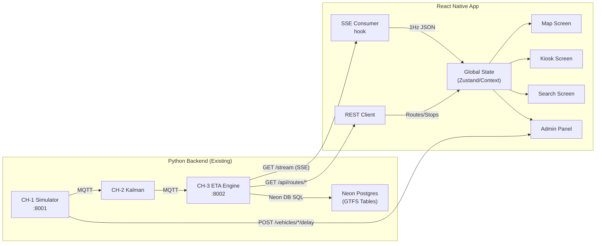

# YARA Mobile — Product Requirements Document (PRD)

> **React Native monorepo**: two apps — YARA User App (passenger) + YARA Admin App (operator/judge).
> Derived from a deep audit of the existing Astro.js + React web dashboard (CH-4), the Python backend pipeline (CH-1/2/3), and Neon DB GTFS integration.

---

## 1. Executive Summary

**YARA** is a Smart India Hackathon (SIH) 2026 public transit intelligence platform that provides real-time bus ETAs, passenger density estimation, and route exploration for Chennai's MTC bus network. The existing system consists of a 4-channel pipeline (Simulator → Kalman Fusion → ETA Engine → Web Dashboard) built on Python + Astro.js/React.

This PRD defines the requirements for a **React Native monorepo** containing two distinct apps:

| App | Users | Purpose |
|---|---|---|
| **YARA User App** | Passengers, commuters | Live ETA map, route search, nearby stops, kiosk mode |
| **YARA Admin App** | Judges, operators, testers | Fault injection panel, fleet overview, scenario runner, Neon DB inspector |

---

## 2. Problem Statement

The current Yara dashboard is a web-only Astro.js application served at `localhost:4321`. For the SIH 2026 demo and real-world deployment:

1. **Passengers** need a native mobile experience — fast launch, GPS-aware nearby stops, push notifications for delays.
2. **Judges** need to see the demo on a phone screen to evaluate "real-world viability" beyond a browser tab.
3. **Kiosk Mode** needs to run as a dedicated fullscreen app on tablets at bus stops.

---

## 3. Target Users

| Persona | Needs | Priority |
|---|---|---|
| **Commuter** | Live ETA countdown, nearby stops, route search, occupancy badges | P0 |
| **Kiosk Display** | Fullscreen auto-refreshing arrival board at bus stops | P0 |
| **Judge / Demo Operator** | Fault injection panel (delay/dropout/crowd) + event causality log | P0 |
| **Transit Operator** | Fleet overview, multi-vehicle tracking (future) | P1 |

---

## 4. Functional Requirements

### 4.1 Live Transit Stream (SSE Consumer)

The core data pipeline endpoint is `GET http://<backend>:8002/stream` (Server-Sent Events). The mobile app must consume this 1Hz JSON stream identically to the web dashboard.

**SSE Payload Schema** (from [`useTransitStream.ts`](file:///c:/Users/Srivarsan/Desktop/SIH-inthack-2026/dashboard/src/lib/useTransitStream.ts)):

```typescript
interface TransitSnapshot {
  ts: number;
  vehicle: {
    lat: number;
    lon: number;
    leg: "outbound" | "dwell" | "inbound";
    progress: number;             // 0.0 → 1.0
    source: "gnss" | "kalman_estimated";
    trip_id: string;
    block_id: string;
  };
  outbound: {
    T_outbound_sec: number;
    route_duration_sec?: number;
  };
  inbound: {
    trip_id: string;
    T_total_sec: number;          // Compound ETA = T_out + T_dwell + T_in
    T_outbound_sec: number;
    T_dwell_sec: number;
    T_inbound_sec: number;
    occupancy_band: "SEATS_AVAILABLE" | "MODERATE" | "STANDING_ROOM" | "VERY_CROWDED";
    route_duration_sec?: number;
  };
  meta?: {
    eta_mode: "ml" | "calculative";
    hour_of_day: number;
  };
  event_log: Array<{
    ts: string;
    event: string;
    T_total_before_sec: number;
    T_total_after_sec: number;
    delta_sec: number;
  }>;
}
```

**Requirements:**
- [ ] Connect to SSE endpoint with auto-reconnect (3s delay, 5 max attempts before mock fallback)
- [ ] Parse 1Hz JSON payloads and update global state
- [ ] Display connection status indicator (green dot = live, red dot = disconnected)
- [ ] Graceful mock data fallback when backend unavailable

### 4.2 Home / Overview Screen

Replicates [`ProjectLandingHome.tsx`](file:///c:/Users/Srivarsan/Desktop/SIH-inthack-2026/dashboard/src/components/ProjectLandingHome.tsx):

- [ ] Animated Yara logo hero section
- [ ] Pipeline status indicators (Simulator, Kalman, ETA Engine — green/red)
- [ ] Feature highlights grid (Live ETA, Density, Kalman Filter, Kiosk)
- [ ] "Launch Live Dashboard" CTA button → navigates to Live Map
- [ ] Hackathon demo section with inject buttons for judges

### 4.3 Live Map Screen

Replicates the "Home" / "Live Map" tab in [`ChaloHomeView.tsx`](file:///c:/Users/Srivarsan/Desktop/SIH-inthack-2026/dashboard/src/components/ChaloHomeView.tsx):

- [ ] Interactive map (react-native-maps or Mapbox) centered on Chennai (13.0302, 80.1806)
- [ ] Animated bus marker showing real-time position from SSE stream
- [ ] Bus marker color: desaturated during outbound, highlighted during inbound
- [ ] Route polyline overlay showing the bus path
- [ ] Bottom sheet with:
  - ETA countdown (MM:SS format, ticking live)
  - ETA breakdown: T_outbound + T_dwell + T_inbound
  - Occupancy badge (4-band color system)
  - Bus leg state indicator (Outbound → Dwell → Inbound)
- [ ] Nearby stops markers from GPS location
- [ ] Tap stop marker → show upcoming buses at that stop

### 4.4 Track Bus Screen

- [ ] Track a specific bus by block_id
- [ ] Real-time ETA component breakdown visualization
- [ ] Trip timeline showing outbound → dwell → inbound progression
- [ ] Speed, bearing, and GNSS fix status indicators
- [ ] Event log feed showing ETA recalculation events

### 4.5 Route Search & Exploration

Replicates [`SearchView.tsx`](file:///c:/Users/Srivarsan/Desktop/SIH-inthack-2026/dashboard/src/components/SearchView.tsx) + [`RoutesListView.tsx`](file:///c:/Users/Srivarsan/Desktop/SIH-inthack-2026/dashboard/src/components/RoutesListView.tsx) + [`RouteDetailView.tsx`](file:///c:/Users/Srivarsan/Desktop/SIH-inthack-2026/dashboard/src/components/RouteDetailView.tsx):

**API Endpoints** (from [`neon_client.py`](file:///c:/Users/Srivarsan/Desktop/SIH-inthack-2026/eta_engine/neon_client.py) via [`api.py`](file:///c:/Users/Srivarsan/Desktop/SIH-inthack-2026/eta_engine/api.py)):

| Endpoint | Method | Description |
|---|---|---|
| `/api/routes?page=1&limit=50` | GET | Paginated canonical route list |
| `/api/routes/search?q=S26&limit=20` | GET | Search routes by code/name (returns both directions) |
| `/api/routes/{route_id}/stops?direction=0` | GET | Ordered stops for a route |
| `/api/stops/search?q=broadway&limit=20` | GET | Search stops by name |
| `/api/stops/nearby?lat=13.03&lon=80.18&limit=5` | GET | Nearest stops with upcoming buses |

- [ ] Route search with autocomplete (debounced, 300ms)
- [ ] Route list with pagination (50 per page)
- [ ] Route detail view with:
  - Forward (direction_id=0) and Return (direction_id=1) stop lists
  - Map showing all stops as markers connected by polyline
  - Tap-to-toggle direction
  - Stop-level arrival times from GTFS schedule
  - Origin / destination display with terminus inference
- [ ] Stop search with name matching
- [ ] Nearby stops discovery using device GPS
  - Walk time estimate (distance_km / 4.5 km/h)
  - Upcoming buses at each stop with ETA in minutes

### 4.6 Bus Stop Kiosk Mode

Replicates [`KioskDisplayView.tsx`](file:///c:/Users/Srivarsan/Desktop/SIH-inthack-2026/dashboard/src/components/KioskDisplayView.tsx):

- [ ] Fullscreen arrival board (no navigation chrome)
- [ ] Large countdown timer for next arriving bus
- [ ] Occupancy density badge (4-band: green/yellow/orange/red)
- [ ] ETA component breakdown bars
- [ ] Auto-refresh from SSE stream
- [ ] High-contrast outdoor-readable design

### 4.7 Admin / Judge Panel

Replicates [`AdminPanel.tsx`](file:///c:/Users/Srivarsan/Desktop/SIH-inthack-2026/dashboard/src/components/AdminPanel.tsx) + [`InjectPanel.tsx`](file:///c:/Users/Srivarsan/Desktop/SIH-inthack-2026/dashboard/src/components/InjectPanel.tsx):

**Fault Injection API** (from [`control_api.py`](file:///c:/Users/Srivarsan/Desktop/SIH-inthack-2026/simulator/control_api.py)):

| Endpoint | Method | Body |
|---|---|---|
| `POST /vehicles/{id}/delay` | POST | `{ "seconds": 300 }` |
| `POST /vehicles/{id}/gnss-dropout` | POST | `{ "duration_s": 10 }` |
| `POST /vehicles/{id}/crowd-spike` | POST | `{ "band": "STANDING_ROOM_ONLY", "duration_s": 30 }` |
| `GET /vehicles` | GET | — |
| `GET /health` | GET | — |

- [ ] Inject Delay button (+5 min = 300s)
- [ ] Inject GNSS Dropout button (10s)
- [ ] Inject Crowd Spike button (STANDING_ROOM_ONLY, 30s)
- [ ] Real-time event causality log
- [ ] Vehicle selector dropdown (BUS-001 through BUS-004)
- [ ] Pipeline health indicators

### 4.8 Agency Selector

Replicates [`AgencySelector.tsx`](file:///c:/Users/Srivarsan/Desktop/SIH-inthack-2026/dashboard/src/components/AgencySelector.tsx) + [`agencies.ts`](file:///c:/Users/Srivarsan/Desktop/SIH-inthack-2026/dashboard/src/lib/agencies.ts):

- [ ] Multi-agency support (MTC Chennai, CMRL Metro, BMTC Bangalore, KSRTC Kerala, etc.)
- [ ] Agency picker with logo, name, city, data status
- [ ] Hardcoded route data for offline-first agencies
- [ ] Neon DB live data for MTC Chennai (agency_id=69)

---

## 5. Non-Functional Requirements

| Requirement | Target |
|---|---|
| **End-to-end latency** | Inject event → UI update < 2 seconds |
| **SSE reconnection** | Auto-reconnect with exponential backoff, max 5 attempts |
| **Offline resilience** | Mock data fallback, cached routes, last-known-good ETA display |
| **Map performance** | 60fps map panning with live bus marker updates |
| **Bundle size** | < 30MB APK (excluding map tiles) |
| **Supported platforms** | iOS 15+, Android 10+ |
| **Accessibility** | High-contrast mode, VoiceOver/TalkBack support, minimum 44pt touch targets |

---

## 6. Data Flow Summary



---

## 7. Success Criteria (Demo Checklist)

These directly map to the hackathon judge evaluation criteria from [`AGENTS.md`](file:///c:/Users/Srivarsan/Desktop/SIH-inthack-2026/AGENTS.md):

- [ ] Bus visible on map moving in real-time
- [ ] Outbound bus shows "Completing prior route" with live inbound ETA
- [ ] Inject Delay → countdown jumps within 2s
- [ ] Inject Dropout → map path stays smooth (no teleport)
- [ ] Inject Crowd → occupancy badge changes on inbound trip
- [ ] Event log shows cause → effect from single button press
- [ ] All four numbers change from one inject (pipeline is connected)
- [ ] Works on physical Android/iOS device (not just simulator)

---

## 8. Screen Inventory

### YARA User App

| # | Screen | Source Web Component | Priority |
|---|---|---|---|
| 1 | Overview / Landing | `ProjectLandingHome.tsx` (396 lines) | P0 |
| 2 | Live Map + Bottom Sheet | `ChaloHomeView.tsx` (1760 lines) — Home tab | P0 |
| 3 | Track Bus | `ChaloHomeView.tsx` — Track tab + `TripTimeline.tsx` | P0 |
| 4 | Route List | `RoutesListView.tsx` | P0 |
| 5 | Route Detail | `RouteDetailView.tsx` | P0 |
| 6 | Search (Routes + Stops) | `SearchView.tsx` + `SearchAutocomplete.tsx` | P0 |
| 7 | Kiosk Display | `KioskDisplayView.tsx` | P0 |

### YARA Admin App (new — no direct web equivalent for all)

| # | Screen | Source / Inspiration | Priority |
|---|---|---|---|
| 1 | Fleet Dashboard | `AdminPanel.tsx` — vehicle overview section | P0 |
| 2 | Fault Injection Panel | `AdminPanel.tsx` + `InjectPanel.tsx` | P0 |
| 3 | Scenario Runner | New — pre-built judge demo sequences | P0 |
| 4 | Database Inspector | `ApiInspectorModal.tsx` + Neon DB endpoints | P1 |
| 5 | Vehicle Detail | `AdminPanel.tsx` — vehicle telemetry section | P1 |

---

## 9. Locked Contracts (from `shared/constants.py`)

These values are **immutable** across all channels and the mobile app:

```python
MQTT_HOST           = "localhost"
MQTT_PORT           = 1883
TOPIC_TELEMETRY     = "fleet/bus_1/telemetry"
TOPIC_FUSED         = "fleet/bus_1/fused"
ETA_API_PORT        = 8002        # CH-3: /eta, /stream, /api/routes/*
SIM_CONTROL_PORT    = 8001        # CH-1: /vehicles/*/delay, etc.
BLOCK_ID            = "block_001"
BUS_CAPACITY        = 40          # seated
BUS_MAX_CAPACITY    = 55          # absolute max (standing)
OUTBOUND_TOTAL_SEC  = 1500        # 25 min
INBOUND_TOTAL_SEC   = 1500        # 25 min
DWELL_BASELINE_SEC  = 300         # 5 min default halt
```

The mobile app connects to these ports over the network (LAN IP or tunneled URL for demo).
