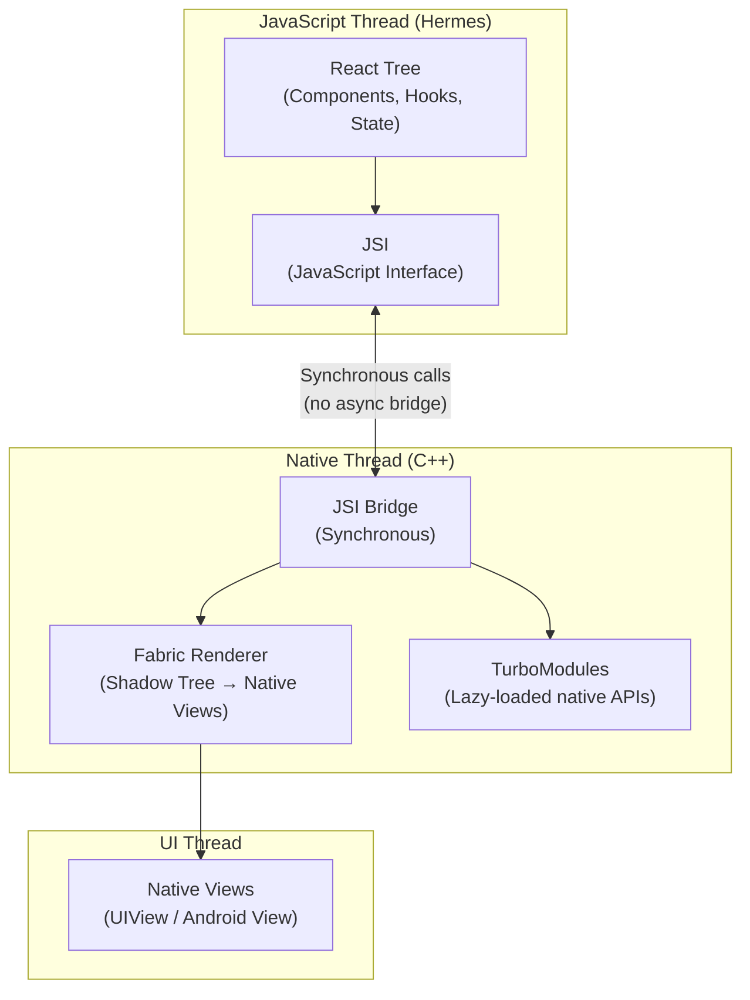

# YARA Mobile — Tech Stack & Implementation Guide

> Complete technology choices, dependency map, project structure, and implementation
> guide for building the YARA React Native monorepo (User App + Admin App).
>
> Based on: [React Native 0.87 Docs](https://reactnative.dev/docs/getting-started) ·
> [Core Components & APIs](https://reactnative.dev/docs/components-and-apis) ·
> [Architecture Overview](https://reactnative.dev/architecture/overview)

---

## 1. Core Technology Stack

### 1.1 Runtime & Framework

| Layer | Technology | Install | Justification |
|---|---|---|---|
| **Framework** | React Native 0.87 | (via Expo) | Cross-platform iOS/Android; New Architecture (Fabric) stable |
| **Dev Platform** | Expo SDK 53 | `npx create-expo-app@latest` | OTA updates, Expo Go dev, managed workflow |
| **JS Engine** | Hermes | (bundled with RN 0.87) | Default engine; faster startup, lower memory |
| **Language** | TypeScript 5.x | `npm install -D typescript@latest` | Full type safety, matches web codebase |
| **Architecture** | New Architecture (Fabric + JSI) | Enabled by default in RN 0.87 | Synchronous native calls, better performance |

> **RN New Architecture** (stable in 0.74+, default in 0.75+):
> - **Fabric** — new C++ rendering engine (replaces Shadow Thread)
> - **JSI** — JavaScript Interface replacing the async Bridge
> - **TurboModules** — lazy-loaded native modules
> - **Hermes** — default JS engine, AOT bytecode compilation
>
> All third-party packages used must support the New Architecture. All packages
> listed below are New Architecture compatible.

### 1.2 Navigation

| Package | Install | Usage |
|---|---|---|
| `@react-navigation/native@latest` | `npm install @react-navigation/native@latest` | Core navigation library |
| `@react-navigation/bottom-tabs@latest` | `npm install @react-navigation/bottom-tabs@latest` | 5-tab main navigation |
| `@react-navigation/native-stack@latest` | `npm install @react-navigation/native-stack@latest` | Stack nav (route detail, kiosk, admin) |
| `react-native-screens@latest` | `npx expo install react-native-screens@latest` | Native screen containers (required by RN Nav) |
| `react-native-safe-area-context@latest` | `npx expo install react-native-safe-area-context@latest` | Safe area insets for notches |

### 1.3 Maps

| Package | Install | Usage |
|---|---|---|
| `react-native-maps@latest` | `npx expo install react-native-maps@latest` | Interactive map — Google Maps (Android) + Apple Maps (iOS) |

> **Why react-native-maps over MapLibre?**
> - The web dashboard uses MapLibre-GL (`maplibre-gl@6.2`), but react-native-maps is the
>   standard production-grade choice for RN with full New Architecture support.
> - For the kiosk/judge demo, Google Maps tiles give cleaner Chennai street detail.
> - If OpenStreetMap tiles required, use `@maplibre/maplibre-react-native@latest` instead.

### 1.4 Animations & Gestures

| Package | Install | Usage |
|---|---|---|
| `react-native-reanimated@latest` | `npx expo install react-native-reanimated@latest` | 60fps native-driver animations (bus marker, transitions) |
| `react-native-gesture-handler@latest` | `npx expo install react-native-gesture-handler@latest` | Bottom sheet drag, swipe gestures |
| `@gorhom/bottom-sheet@latest` | `npm install @gorhom/bottom-sheet@latest` | Map overlay bottom sheet with snap points |

### 1.5 Data & Networking

| Package | Install | Usage |
|---|---|---|
| `react-native-sse@latest` | `npm install react-native-sse@latest` | EventSource polyfill — RN has no native SSE |
| `fetch` (built-in) | — | REST client for all `/api/*` calls |
| `@react-native-async-storage/async-storage@latest` | `npx expo install @react-native-async-storage/async-storage@latest` | Route cache persistence |

> **Why react-native-sse?**
> React Native does not ship a native `EventSource` implementation.
> `react-native-sse` is a lightweight polyfill that wraps `XMLHttpRequest` for
> streaming — compatible with New Architecture and Hermes.

### 1.6 Icons

| Package | Install | Usage |
|---|---|---|
| `lucide-react-native@latest` | `npm install lucide-react-native@latest` | Matches web dashboard's `lucide-react` icons exactly |
| `react-native-svg@latest` | `npx expo install react-native-svg@latest` | SVG support (required by lucide-react-native + Yara logo) |

### 1.7 Location & Device

| Package | Install | Usage |
|---|---|---|
| `expo-location@latest` | `npx expo install expo-location@latest` | GPS for nearby stops — foreground permission |
| `expo-keep-awake@latest` | `npx expo install expo-keep-awake@latest` | Kiosk mode: prevent screen sleep |
| `expo-screen-orientation@latest` | `npx expo install expo-screen-orientation@latest` | Lock landscape for tablet kiosk |
| `expo-status-bar@latest` | `npx expo install expo-status-bar@latest` | Hide status bar in kiosk mode |
| `expo-clipboard@latest` | `npx expo install expo-clipboard@latest` | Copy-to-clipboard in Admin DB inspector |

### 1.8 State Management

| Approach | Justification |
|---|---|
| **React Context + useReducer** | Per project rules: no Redux/Zustand. Two contexts: `TransitContext` (SSE) + `RoutesContext` (REST). Sufficient for two data sources. |

### 1.9 Build & Distribution

| Package | Install | Usage |
|---|---|---|
| EAS CLI | `npm install -g eas-cli@latest` | Build APK/IPA, OTA updates |
| Expo CLI | `npm install -g expo@latest` | Dev server, Expo Go |

---

## 2. React Native Core Components Used

From [reactnative.dev/docs/components-and-apis](https://reactnative.dev/docs/components-and-apis):

### Basic Components

| Component | Used In | Purpose |
|---|---|---|
| `View` | All screens | Layout container — replaces HTML `<div>` |
| `Text` | All screens | Text rendering — replaces HTML `<p>`, `<span>` |
| `Image` | Overview, Agency selector | Static images, logos |
| `TextInput` | Search screen | Route/stop search input field |
| `ScrollView` | Route detail, Admin screens | Scrollable content |
| `StyleSheet` | All components | CSS-in-JS style definitions |

### List Components

| Component | Used In | Purpose |
|---|---|---|
| `FlatList` | Route list, Stop list, Event log | Virtualized scrollable list — replaces CSS scroll + map |
| `SectionList` | Admin fleet screen | Grouped vehicle list by block |

### Touch & Interaction

| Component | Used In | Purpose |
|---|---|---|
| `TouchableOpacity` | All buttons, cards | Touch feedback with opacity fade |
| `Pressable` | Inject buttons | Advanced press states (pressed/hovered) |
| `TouchableHighlight` | Admin danger buttons | Highlight feedback for critical actions |

### Layout & Display

| Component | Used In | Purpose |
|---|---|---|
| `StatusBar` | Kiosk screen | Hide/configure status bar |
| `Modal` | Stop detail, API inspector | Overlay modal |
| `ActivityIndicator` | Loading states | Spinner for data fetch |
| `RefreshControl` | Route list | Pull-to-refresh |

### Platform APIs (from [reactnative.dev/docs/accessibilityinfo](https://reactnative.dev/docs/accessibilityinfo))

| API | Used In | Purpose |
|---|---|---|
| `AccessibilityInfo` | All screens | Detect screen reader, reduce motion preference |
| `Vibration` | Inject buttons | Haptic feedback on fault injection |
| `Linking` | Overview screen | Open external URLs |
| `Platform` | Theme, maps config | `Platform.OS === 'ios'` conditionals |
| `useColorScheme` | Theme | Auto dark/light mode detection |
| `Dimensions` | Maps, kiosk | Screen width/height for responsive layout |
| `AppState` | SSE hook | Reconnect SSE on app foreground |

### Accessibility (required)

Per RN docs — all interactive elements must have:
- `accessibilityLabel` — describes the action for screen readers
- `accessibilityRole` — `button`, `header`, `text`, `image`, etc.
- `accessibilityHint` — additional context when label alone isn't enough
- Minimum 44×44pt touch target (via `minHeight: 44, minWidth: 44` in StyleSheet)

```typescript
// Example: Inject button with full accessibility
<Pressable
  accessibilityRole="button"
  accessibilityLabel="Inject 5-minute delay on BUS-001"
  accessibilityHint="Sends a delay fault to the simulator and updates the ETA"
  style={styles.injectButton}
  onPress={handleInjectDelay}
>
  <Text>⚠️ Inject Delay +5 min</Text>
</Pressable>
```

---

## 3. React Native Architecture (New Architecture)

From [reactnative.dev/architecture/overview](https://reactnative.dev/architecture/overview):



**Key implications for YARA app:**

| Old Architecture | New Architecture (RN 0.87) | Impact |
|---|---|---|
| Async Bridge (JSON stringify/parse) | JSI (direct C++ memory access) | Bus marker animations run at true 60fps |
| Shadow Thread (Yoga layout) | Fabric C++ renderer | Faster layout for complex ETA bottom sheet |
| All modules loaded at startup | TurboModules (lazy) | Faster app cold start |
| AsyncStorage blocking | Async Storage via TurboModule | Non-blocking route cache reads |

---

## 4. Full Dependency Installation (All At Once)

### Monorepo Root Setup

```bash
# Create monorepo
mkdir yara-mobile && cd yara-mobile
git init

# Root package.json with workspaces
cat > package.json << 'EOF'
{
  "name": "yara-mobile",
  "private": true,
  "workspaces": ["packages/*"],
  "scripts": {
    "user-app": "npm -w packages/user-app run start",
    "admin-app": "npm -w packages/admin-app run start",
    "typecheck": "npm -w packages/shared run typecheck && npm -w packages/user-app run typecheck && npm -w packages/admin-app run typecheck"
  }
}
EOF
```

### Shared Package

```bash
mkdir -p packages/shared && cd packages/shared

cat > package.json << 'EOF'
{
  "name": "@yara/shared",
  "version": "1.0.0",
  "main": "index.ts",
  "scripts": {
    "typecheck": "tsc --noEmit"
  },
  "peerDependencies": {
    "react": "*",
    "react-native": "*"
  }
}
EOF

cd ../..
```

### User App Bootstrap

```bash
cd packages

# Create Expo app
npx -y create-expo-app@latest user-app --template blank-typescript
cd user-app

# Navigation
npm install @react-navigation/native@latest @react-navigation/bottom-tabs@latest @react-navigation/native-stack@latest
npx expo install react-native-screens@latest react-native-safe-area-context@latest

# Maps
npx expo install react-native-maps@latest

# Animations
npx expo install react-native-reanimated@latest react-native-gesture-handler@latest
npm install @gorhom/bottom-sheet@latest

# SSE + Storage
npm install react-native-sse@latest
npx expo install @react-native-async-storage/async-storage@latest

# Icons + SVG
npm install lucide-react-native@latest
npx expo install react-native-svg@latest

# Device APIs
npx expo install expo-location@latest expo-keep-awake@latest expo-screen-orientation@latest expo-status-bar@latest expo-clipboard@latest

# Shared package link
npm install @yara/shared@*

cd ../..
```

### Admin App Bootstrap

```bash
cd packages

npx -y create-expo-app@latest admin-app --template blank-typescript
cd admin-app

# Same dependencies as user-app
npm install @react-navigation/native@latest @react-navigation/bottom-tabs@latest @react-navigation/native-stack@latest
npx expo install react-native-screens@latest react-native-safe-area-context@latest react-native-maps@latest
npx expo install react-native-reanimated@latest react-native-gesture-handler@latest
npm install @gorhom/bottom-sheet@latest react-native-sse@latest
npx expo install @react-native-async-storage/async-storage@latest react-native-svg@latest
npx expo install expo-location@latest expo-keep-awake@latest expo-status-bar@latest expo-clipboard@latest
npm install lucide-react-native@latest
npm install @yara/shared@*

cd ../..
```

### `package.json` — Expected Final Shape (per app)

```json
{
  "dependencies": {
    "@gorhom/bottom-sheet": "latest",
    "@react-native-async-storage/async-storage": "latest",
    "@react-navigation/bottom-tabs": "latest",
    "@react-navigation/native": "latest",
    "@react-navigation/native-stack": "latest",
    "@yara/shared": "*",
    "expo": "~53.0.0",
    "expo-clipboard": "latest",
    "expo-keep-awake": "latest",
    "expo-location": "latest",
    "expo-screen-orientation": "latest",
    "expo-status-bar": "latest",
    "lucide-react-native": "latest",
    "react": "19.0.0",
    "react-native": "0.79.x",
    "react-native-gesture-handler": "latest",
    "react-native-maps": "latest",
    "react-native-reanimated": "latest",
    "react-native-safe-area-context": "latest",
    "react-native-screens": "latest",
    "react-native-sse": "latest",
    "react-native-svg": "latest"
  }
}
```

---

## 5. TypeScript Configuration

### `tsconfig.json` (each app)

```json
{
  "extends": "expo/tsconfig.base",
  "compilerOptions": {
    "strict": true,
    "noImplicitAny": true,
    "strictNullChecks": true,
    "baseUrl": ".",
    "paths": {
      "@yara/shared": ["../../packages/shared/index.ts"],
      "@yara/shared/*": ["../../packages/shared/*"]
    }
  },
  "include": ["src/**/*", "App.tsx"]
}
```

### `tsconfig.json` (shared package)

```json
{
  "compilerOptions": {
    "target": "ES2020",
    "module": "ESNext",
    "moduleResolution": "bundler",
    "strict": true,
    "noImplicitAny": true,
    "declaration": true,
    "outDir": "dist",
    "jsx": "react-native"
  },
  "include": ["lib/**/*", "hooks/**/*", "components/**/*", "services/**/*"]
}
```

---

## 6. Project Structure

```
yara-mobile/
├── AGENTS.md                       ← Agentic workflow instructions
├── README.md                       ← Quick start guide
├── .env.example                    ← Backend URL template
├── .gitignore
├── package.json                    ← Workspace root (npm workspaces)
│
├── packages/
│   │
│   ├── shared/                     ← @yara/shared
│   │   ├── package.json            ← name: "@yara/shared"
│   │   ├── tsconfig.json
│   │   ├── index.ts                ← barrel export of everything
│   │   ├── lib/
│   │   │   ├── types.ts            ← 🔒 LOCKED: TransitSnapshot, NeonRoute, etc.
│   │   │   ├── constants.ts        ← 🔒 LOCKED: API URLs, bus constants
│   │   │   └── agencies.ts         ← Agency presets (port from web)
│   │   ├── hooks/
│   │   │   ├── useTransitStream.ts ← SSE consumer (react-native-sse)
│   │   │   ├── useNeonRoutes.ts    ← REST client (native fetch)
│   │   │   ├── useLocation.ts      ← GPS wrapper (expo-location)
│   │   │   └── useCountdown.ts     ← Tick timer for ETA countdown
│   │   ├── components/             ← Shared UI primitives
│   │   │   ├── OccupancyBadge.tsx
│   │   │   ├── ETACountdown.tsx
│   │   │   ├── LiveSignalIcon.tsx
│   │   │   ├── TripTimeline.tsx
│   │   │   ├── ETABreakdownBar.tsx
│   │   │   ├── RouteCard.tsx
│   │   │   ├── StopCard.tsx
│   │   │   ├── SearchInput.tsx
│   │   │   ├── EmptyState.tsx
│   │   │   └── LoadingShimmer.tsx
│   │   ├── services/
│   │   │   ├── api.ts              ← All REST endpoint calls
│   │   │   └── sse.ts              ← SSE connection manager class
│   │   └── theme/
│   │       ├── colors.ts           ← Color tokens
│   │       ├── typography.ts       ← Font scales
│   │       └── spacing.ts          ← Layout spacing
│   │
│   ├── user-app/                   ← YARA User App
│   │   ├── app.json
│   │   ├── package.json
│   │   ├── tsconfig.json
│   │   ├── App.tsx                 ← Root: Providers + RootNavigator
│   │   ├── assets/
│   │   │   ├── logo/
│   │   │   └── icon.png
│   │   └── src/
│   │       ├── navigation/
│   │       │   ├── RootNavigator.tsx    ← Stack: Tabs + Kiosk + Admin modal
│   │       │   ├── TabNavigator.tsx     ← 5 tabs: Overview/Map/Track/Routes/Search
│   │       │   └── types.ts            ← Navigation param types
│   │       ├── screens/
│   │       │   ├── OverviewScreen.tsx   ← ProjectLandingHome port
│   │       │   ├── LiveMapScreen.tsx    ← Map + bottom sheet
│   │       │   ├── TrackBusScreen.tsx   ← Trip timeline + telemetry
│   │       │   ├── RoutesScreen.tsx     ← Paginated route list
│   │       │   ├── SearchScreen.tsx     ← Route + stop search
│   │       │   ├── RouteDetailScreen.tsx ← Stops map + list
│   │       │   ├── KioskScreen.tsx      ← Fullscreen arrival board
│   │       │   └── AdminScreen.tsx      ← Judge fault injection panel
│   │       ├── components/
│   │       │   ├── BusMarker.tsx        ← Animated map marker
│   │       │   └── AgencySelector.tsx   ← Agency picker
│   │       └── context/
│   │           ├── TransitContext.tsx   ← SSE data provider
│   │           └── RoutesContext.tsx    ← Routes/stops provider
│   │
│   └── admin-app/                  ← YARA Admin App
│       ├── app.json
│       ├── package.json
│       ├── tsconfig.json
│       ├── App.tsx
│       └── src/
│           ├── navigation/
│           │   └── AdminNavigator.tsx   ← Stack navigator
│           ├── screens/
│           │   ├── DashboardScreen.tsx  ← Fleet overview
│           │   ├── InjectScreen.tsx     ← Fault injection panel
│           │   ├── FleetScreen.tsx      ← Vehicle list + telemetry
│           │   ├── ScenarioScreen.tsx   ← Pre-built demo sequences
│           │   └── DatabaseScreen.tsx   ← Neon DB inspector
│           ├── components/
│           │   ├── VehicleCard.tsx
│           │   ├── InjectButton.tsx
│           │   └── ScenarioRunner.tsx
│           └── context/
│               └── AdminContext.tsx     ← Vehicle state, inject history
│
└── docs/
    ├── PRD.md
    ├── ARCHITECTURE.md
    ├── DESIGN.md
    └── TECH_STACK.md               ← This file
```

---

## 7. Key Implementation Patterns

### 7.1 SSE Consumer (New Architecture compatible)

```typescript
// packages/shared/hooks/useTransitStream.ts
import { useState, useEffect, useCallback, useRef } from 'react';
import { AppState, AppStateStatus } from 'react-native';
import EventSource from 'react-native-sse';
import { API_BASE_URL, SSE_RECONNECT_DELAY_MS, SSE_MAX_RECONNECT_ATTEMPTS } from '../lib/constants';
import type { TransitSnapshot } from '../lib/types';

const SSE_URL = `${API_BASE_URL}/stream`;

const DEFAULT_MOCK: TransitSnapshot = {
  ts: Math.floor(Date.now() / 1000),
  vehicle: { lat: 13.0302, lon: 80.1806, leg: 'outbound', progress: 0.45, source: 'gnss', trip_id: 'trip_outbound_1', block_id: 'block_001' },
  outbound: { T_outbound_sec: 420 },
  inbound: { trip_id: 'trip_inbound_1', T_total_sec: 720, T_outbound_sec: 420, T_dwell_sec: 180, T_inbound_sec: 120, occupancy_band: 'SEATS_AVAILABLE' },
  event_log: [],
};

export function useTransitStream() {
  const [data, setData] = useState<TransitSnapshot>(DEFAULT_MOCK);
  const [isConnected, setIsConnected] = useState(false);
  const esRef = useRef<EventSource | null>(null);
  const attemptsRef = useRef(0);
  const timerRef = useRef<ReturnType<typeof setTimeout> | null>(null);

  const connect = useCallback(() => {
    esRef.current?.close();
    if (timerRef.current) clearTimeout(timerRef.current);

    const es = new EventSource(SSE_URL);
    esRef.current = es;

    es.addEventListener('open', () => {
      setIsConnected(true);
      attemptsRef.current = 0;
    });

    es.addEventListener('message', (event: any) => {
      try {
        setData(JSON.parse(event.data));
        setIsConnected(true);
      } catch {}
    });

    es.addEventListener('error', () => {
      setIsConnected(false);
      es.close();
      esRef.current = null;
      if (attemptsRef.current < SSE_MAX_RECONNECT_ATTEMPTS) {
        attemptsRef.current++;
        timerRef.current = setTimeout(connect, SSE_RECONNECT_DELAY_MS);
      }
      // else: stay on mock data fallback
    });
  }, []);

  // Reconnect when app comes back to foreground
  useEffect(() => {
    const sub = AppState.addEventListener('change', (next: AppStateStatus) => {
      if (next === 'active' && !esRef.current) {
        attemptsRef.current = 0;
        connect();
      }
    });
    return () => sub.remove();
  }, [connect]);

  useEffect(() => {
    connect();
    return () => {
      esRef.current?.close();
      if (timerRef.current) clearTimeout(timerRef.current);
    };
  }, [connect]);

  return { data, isConnected };
}
```

### 7.2 Animated Bus Marker

```typescript
// packages/user-app/src/components/BusMarker.tsx
import React, { useEffect } from 'react';
import { View, StyleSheet } from 'react-native';
import { Marker } from 'react-native-maps';
import Animated, { useSharedValue, withTiming, useAnimatedStyle } from 'react-native-reanimated';
import type { BusLeg } from '@yara/shared';

interface Props { lat: number; lon: number; leg: BusLeg; bearing?: number }

// react-native-maps Marker doesn't support Reanimated directly —
// smooth movement via coordinate interpolation on the Marker itself
export function BusMarker({ lat, lon, leg, bearing = 0 }: Props) {
  const opacity = useSharedValue(leg === 'outbound' ? 0.6 : 1.0);
  const scale = useSharedValue(1);

  useEffect(() => {
    opacity.value = withTiming(leg === 'outbound' ? 0.6 : 1.0, { duration: 500 });
    if (leg === 'dwell') {
      scale.value = withTiming(1.2, { duration: 300 });
    } else {
      scale.value = withTiming(1.0, { duration: 300 });
    }
  }, [leg]);

  const tint = leg === 'inbound' ? '#2563EB' : leg === 'dwell' ? '#EAB308' : '#94A3B8';

  return (
    <Marker
      coordinate={{ latitude: lat, longitude: lon }}
      rotation={bearing}
      anchor={{ x: 0.5, y: 0.5 }}
      flat
    >
      <View style={[styles.marker, { backgroundColor: tint }]}>
        <View style={styles.arrow} />
      </View>
    </Marker>
  );
}

const styles = StyleSheet.create({
  marker: { width: 24, height: 24, borderRadius: 12, borderWidth: 2, borderColor: '#fff', alignItems: 'center', justifyContent: 'center' },
  arrow: { width: 0, height: 0, borderLeftWidth: 4, borderRightWidth: 4, borderBottomWidth: 8, borderStyle: 'solid', borderLeftColor: 'transparent', borderRightColor: 'transparent', borderBottomColor: '#fff' },
});
```

### 7.3 Accessibility Implementation

```typescript
// All interactive components must implement:
import { AccessibilityInfo, useEffect } from 'react';

// Check reduced motion preference (mirrors web prefers-reduced-motion)
const [reduceMotion, setReduceMotion] = useState(false);
useEffect(() => {
  AccessibilityInfo.isReduceMotionEnabled().then(setReduceMotion);
  const sub = AccessibilityInfo.addEventListener('reduceMotionChanged', setReduceMotion);
  return () => sub.remove();
}, []);

// Apply to animations:
const animDuration = reduceMotion ? 0 : 1000;
```

### 7.4 Constants (locked, sourced from `shared/constants.py`)

```typescript
// packages/shared/lib/constants.ts
export const API_BASE_URL = process.env.EXPO_PUBLIC_API_URL ?? 'http://192.168.1.100:8002';
export const SIM_BASE_URL = process.env.EXPO_PUBLIC_SIM_URL ?? 'http://192.168.1.100:8001';

// Transit (mirror of shared/constants.py)
export const BLOCK_ID              = 'block_001';
export const BUS_CAPACITY          = 40;
export const BUS_MAX_CAPACITY      = 55;
export const OUTBOUND_TOTAL_SEC    = 1500;
export const INBOUND_TOTAL_SEC     = 1500;
export const DWELL_BASELINE_SEC    = 300;
export const DWELL_RECOVERY_FACTOR = 0.3;
export const DWELL_MINIMUM_SEC     = 60;
export const BAND_MODERATE_RATIO   = 1.2;

// SSE
export const SSE_RECONNECT_DELAY_MS     = 3000;
export const SSE_MAX_RECONNECT_ATTEMPTS = 5;
```

---

## 8. Environment Configuration

### `.env.example`

```bash
EXPO_PUBLIC_API_URL=http://192.168.1.100:8002
EXPO_PUBLIC_SIM_URL=http://192.168.1.100:8001
```

> Find your LAN IP: `ipconfig | findstr "IPv4"` (Windows)

### `app.json` (user-app)

```json
{
  "expo": {
    "name": "YARA Transit",
    "slug": "yara-transit",
    "version": "1.0.0",
    "orientation": "portrait",
    "icon": "./assets/logo/icon.png",
    "newArchEnabled": true,
    "ios": {
      "bundleIdentifier": "com.yara.transit",
      "supportsTablet": true,
      "config": { "googleMapsApiKey": "YOUR_IOS_KEY" },
      "infoPlist": {
        "NSLocationWhenInUseUsageDescription": "YARA needs location to show nearby bus stops."
      }
    },
    "android": {
      "package": "com.yara.transit",
      "adaptiveIcon": { "foregroundImage": "./assets/logo/adaptive-icon.png", "backgroundColor": "#0F172A" },
      "config": { "googleMaps": { "apiKey": "YOUR_ANDROID_KEY" } },
      "permissions": ["ACCESS_FINE_LOCATION", "ACCESS_COARSE_LOCATION"]
    },
    "plugins": [
      "expo-location",
      "expo-keep-awake",
      "expo-screen-orientation",
      ["react-native-maps", { "googleMapsApiKey": "YOUR_ANDROID_KEY" }]
    ]
  }
}
```

### `app.json` (admin-app)

```json
{
  "expo": {
    "name": "YARA Admin",
    "slug": "yara-admin",
    "version": "1.0.0",
    "orientation": "default",
    "newArchEnabled": true,
    "ios": { "bundleIdentifier": "com.yara.admin" },
    "android": { "package": "com.yara.admin" },
    "plugins": ["expo-location", "expo-clipboard"]
  }
}
```

---

## 9. Development Workflow

### 9.1 Startup Sequence

```bash
# Terminal 1 — Backend pipeline (parent repo)
cd ../SIH-inthack-2026 && python run_local.py

# Terminal 2 — User App
cd packages/user-app && npx expo start

# Terminal 3 — Admin App
cd packages/admin-app && npx expo start --port 8082
```

### 9.2 Type Checking (CI gate)

```bash
# From repo root
npm run typecheck
# Must pass with zero errors before opening any PR
```

### 9.3 Physical Device Connection

1. Phone and dev machine on **same WiFi**
2. `EXPO_PUBLIC_API_URL=http://<LAN_IP>:8002` in `.env.local`
3. Scan QR with Expo Go (iOS App Store / Google Play)
4. If WiFi isolated: `npx expo start --tunnel` (uses ngrok)

---

## 10. Build & Release

```bash
# Configure EAS (one time)
cd packages/user-app && eas build:configure

# Development build (includes dev client, faster iteration)
eas build --platform android --profile development
eas build --platform ios --profile development

# Production APK
eas build --platform android --profile production

# iOS IPA
eas build --platform ios --profile production

# OTA update (no rebuild, ships in seconds)
eas update --branch production --message "Fix SSE reconnect"
```

---

## 11. Web → React Native Component Mapping

| Web Component (Astro/React) | RN Component | Key Changes |
|---|---|---|
| `ProjectLandingHome.tsx` | `OverviewScreen.tsx` | `div` → `View`, `p` → `Text`, CSS → `StyleSheet` |
| `ChaloHomeView.tsx` (1760 lines) | `LiveMapScreen` + `TrackBusScreen` | Split; Leaflet/MapLibre → `react-native-maps`; CSS overlay → `@gorhom/bottom-sheet` |
| `RoutesListView.tsx` | `RoutesScreen.tsx` | `div scroll` → `FlatList`; pagination via `onEndReached` |
| `RouteDetailView.tsx` | `RouteDetailScreen.tsx` | MapLibre → `MapView`; toggle → `SegmentedControl` |
| `SearchView.tsx` | `SearchScreen.tsx` | `input` → `TextInput`; keyboard-aware `KeyboardAvoidingView` |
| `KioskDisplayView.tsx` | `KioskScreen.tsx` | `position: fixed` → fullscreen layout; `expo-keep-awake` |
| `AdminPanel.tsx` | `InjectScreen.tsx` + `FleetScreen.tsx` | Split into admin app; same POST logic |
| `ApiInspectorModal.tsx` | `DatabaseScreen.tsx` | Admin app screen |
| `ETACountdown.tsx` | `ETACountdown.tsx` (shared) | Direct port — same logic, `StyleSheet` not CSS |
| `OccupancyBadge.tsx` | `OccupancyBadge.tsx` (shared) | Direct port |
| `TripTimeline.tsx` | `TripTimeline.tsx` (shared) | Direct port |
| `LiveSignalIcon.tsx` | `LiveSignalIcon.tsx` (shared) | SVG via `react-native-svg` |
| `useTransitStream.ts` | `useTransitStream.ts` (shared) | `EventSource` → `react-native-sse` |
| `useNeonRoutes.ts` | `useNeonRoutes.ts` (shared) | Near-identical — `fetch` works in RN |
| `agencies.ts` | `agencies.ts` (shared) | Direct copy — pure data, zero DOM deps |

---

## 12. Shared Components Catalogue (`packages/shared/components/`)

Every component below lives in `@yara/shared` and is imported by **both** user-app and admin-app.
Each entry shows: the source web file, props interface, RN translation notes, and complete RN implementation.

---

### 12.1 `OccupancyBadge`

**Source**: [`dashboard/src/components/OccupancyBadge.tsx`](../dashboard/src/components/OccupancyBadge.tsx) — 56 lines
**Used by**: LiveMapScreen, KioskScreen, TrackBusScreen, FleetScreen (admin)

**Props:**
```typescript
interface OccupancyBadgeProps {
  band: OccupancyBand;           // 'SEATS_AVAILABLE' | 'MODERATE' | 'STANDING_ROOM' | 'VERY_CROWDED'
  size?: 'sm' | 'md' | 'lg';    // sm=kiosk compact, md=default, lg=kiosk fullscreen
  showSubtext?: boolean;         // show pax range subtext (default true)
}
```

**Band config (from web source, exact values):**
| Band | Label | Subtext | Dot Color | Badge BG |
|---|---|---|---|---|
| SEATS_AVAILABLE | Seats Available | Plenty of room onboard (<40 pax) | `#22C55E` | `#F0FDF4` |
| MODERATE | Moderate Crowd | Seating mostly filled (40–48 pax) | `#EAB308` | `#FFFBEB` |
| STANDING_ROOM | Standing Room Only | Seats filled, standing active (48–55 pax) | `#F97316` | `#FFF7ED` |
| VERY_CROWDED | Very Crowded | Near maximum capacity (>55 pax) | `#EF4444` | `#FFF1F2` |

**RN translation notes:**
- `div` → `View`, Tailwind classes → `StyleSheet`
- `lucide-react` `Users` icon → `lucide-react-native` `Users`
- `bg-emerald-50` → `backgroundColor: '#F0FDF4'`
- `animate-pulse` → `react-native-reanimated` pulse sequence

```typescript
// packages/shared/components/OccupancyBadge.tsx
import React, { useEffect } from 'react';
import { View, Text, StyleSheet } from 'react-native';
import { Users } from 'lucide-react-native';
import Animated, {
  useSharedValue, useAnimatedStyle,
  withRepeat, withSequence, withTiming,
} from 'react-native-reanimated';
import type { OccupancyBand } from '../lib/types';

const BAND_CONFIG: Record<OccupancyBand, {
  label: string; subtext: string; dotColor: string; bgColor: string; textColor: string; borderColor: string;
}> = {
  SEATS_AVAILABLE: { label: 'Seats Available',    subtext: 'Plenty of room onboard (<40 pax)',           dotColor: '#22C55E', bgColor: '#F0FDF4', textColor: '#166534', borderColor: '#86EFAC' },
  MODERATE:        { label: 'Moderate Crowd',      subtext: 'Seating mostly filled (40–48 pax)',          dotColor: '#EAB308', bgColor: '#FFFBEB', textColor: '#92400E', borderColor: '#FCD34D' },
  STANDING_ROOM:   { label: 'Standing Room Only',  subtext: 'Seats filled, standing area active (48–55 pax)', dotColor: '#F97316', bgColor: '#FFF7ED', textColor: '#9A3412', borderColor: '#FDBA74' },
  VERY_CROWDED:    { label: 'Very Crowded',         subtext: 'Near maximum capacity (>55 pax)',            dotColor: '#EF4444', bgColor: '#FFF1F2', textColor: '#9F1239', borderColor: '#FCA5A5' },
};

interface OccupancyBadgeProps {
  band: OccupancyBand;
  size?: 'sm' | 'md' | 'lg';
  showSubtext?: boolean;
}

export function OccupancyBadge({ band, size = 'md', showSubtext = true }: OccupancyBadgeProps) {
  const cfg = BAND_CONFIG[band] ?? BAND_CONFIG.SEATS_AVAILABLE;
  const pulse = useSharedValue(1);

  // Pulse on VERY_CROWDED (matches web animate-pulse)
  useEffect(() => {
    if (band === 'VERY_CROWDED') {
      pulse.value = withRepeat(withSequence(withTiming(0.4, { duration: 800 }), withTiming(1, { duration: 800 })), -1);
    } else {
      pulse.value = 1;
    }
  }, [band]);

  const pulseStyle = useAnimatedStyle(() => ({ opacity: pulse.value }));
  const iconSize = size === 'lg' ? 24 : size === 'sm' ? 14 : 18;
  const fontSize = size === 'lg' ? 14 : size === 'sm' ? 10 : 12;

  return (
    <View style={[styles.container, { borderColor: '#E2E8F0' }]}>
      <View style={styles.left}>
        <View style={styles.iconBox}>
          <Users size={iconSize} color="#b17816" />
        </View>
        {showSubtext && (
          <View>
            <Text style={styles.label}>PASSENGER OCCUPANCY DENSITY</Text>
            <Text style={[styles.subtext, { fontSize }]}>{cfg.subtext}</Text>
          </View>
        )}
      </View>
      <View style={[styles.badge, { backgroundColor: cfg.bgColor, borderColor: cfg.borderColor }]}>
        <Animated.View style={[styles.dot, { backgroundColor: cfg.dotColor }, pulseStyle]} />
        <Text style={[styles.badgeText, { color: cfg.textColor, fontSize }]}>{cfg.label}</Text>
      </View>
    </View>
  );
}

const styles = StyleSheet.create({
  container: { padding: 16, borderRadius: 16, backgroundColor: '#fff', borderWidth: 1, flexDirection: 'row', alignItems: 'center', justifyContent: 'space-between', shadowColor: '#000', shadowOpacity: 0.04, shadowRadius: 4, elevation: 1 },
  left: { flexDirection: 'row', alignItems: 'center', gap: 12, flex: 1 },
  iconBox: { width: 40, height: 40, borderRadius: 10, backgroundColor: '#F1F5F9', borderWidth: 1, borderColor: '#E2E8F0', alignItems: 'center', justifyContent: 'center' },
  label: { fontSize: 9, fontWeight: '700', color: '#64748B', textTransform: 'uppercase', letterSpacing: 0.5 },
  subtext: { fontWeight: '700', color: '#0F172A', marginTop: 1 },
  badge: { flexDirection: 'row', alignItems: 'center', gap: 6, paddingHorizontal: 10, paddingVertical: 6, borderRadius: 10, borderWidth: 1 },
  dot: { width: 8, height: 8, borderRadius: 4 },
  badgeText: { fontWeight: '700' },
});
```

---

### 12.2 `ETACountdown`

**Source**: [`dashboard/src/components/ETACountdown.tsx`](../dashboard/src/components/ETACountdown.tsx) — 86 lines
**Used by**: LiveMapScreen, KioskScreen, TrackBusScreen

**Props:**
```typescript
interface ETACountdownProps {
  data: TransitSnapshot;
  size?: 'compact' | 'full' | 'kiosk';  // compact=bottom sheet, full=track screen, kiosk=fullscreen
}
```

**Key logic from source:**
- Displays `T_total_sec` in MM:SS monospace format
- Shows delay warning banner when `is_delayed === true` (red bg, pulse)
- 3-column breakdown: T_outbound (grey) | T_dwell (amber) | T_inbound (grey)
- `formatMMSS(sec)`: `Math.floor(sec/60).padStart(2,'0') + ':' + (sec%60).padStart(2,'0')`
- **Note**: web source reads `is_delayed` and `delay_min` from `data.inbound` — these may not be in current SSE payload. Derive: `is_delayed = data.inbound.T_outbound_sec > 0 && data.vehicle.leg !== 'inbound'`

**RN translation notes:**
- `text-6xl font-mono` → `fontFamily: 'Courier'` or `fontVariant: ['tabular-nums']`
- `animate-pulse` → Reanimated `withRepeat`
- `grid grid-cols-3` → `flexDirection: 'row'` with `flex: 1` per cell
- Font size for kiosk: 72sp

```typescript
// packages/shared/components/ETACountdown.tsx
import React from 'react';
import { View, Text, StyleSheet, Platform } from 'react-native';
import { Clock, AlertTriangle, Wifi } from 'lucide-react-native';
import type { TransitSnapshot } from '../lib/types';

function formatMMSS(sec: number): string {
  const s = Math.max(0, Math.round(sec));
  const m = Math.floor(s / 60);
  return `${String(m).padStart(2, '0')}:${String(s % 60).padStart(2, '0')}`;
}

interface ETACountdownProps {
  data: TransitSnapshot;
  size?: 'compact' | 'full' | 'kiosk';
}

export function ETACountdown({ data, size = 'full' }: ETACountdownProps) {
  const { T_outbound_sec, T_dwell_sec, T_inbound_sec, T_total_sec } = data.inbound;
  const isDelayed = data.vehicle.leg === 'outbound' && T_outbound_sec > 0;
  const timerFontSize = size === 'kiosk' ? 72 : size === 'compact' ? 40 : 56;

  return (
    <View style={[styles.container, isDelayed && styles.delayedContainer]}>
      {/* Header */}
      <View style={styles.header}>
        <View style={styles.headerLeft}>
          <Clock size={14} color="#b17816" />
          <Text style={styles.headerLabel}>PREDICTIVE INBOUND ETA</Text>
        </View>
        <View style={styles.badge}>
          <Text style={styles.badgeText}>GTFS-RT Block Chained</Text>
        </View>
      </View>

      {/* Main timer */}
      <View style={styles.timerSection}>
        <Text style={styles.timerLabel}>BUS ARRIVES IN</Text>
        <Text style={[styles.timer, { fontSize: timerFontSize }, isDelayed && styles.delayedTimer]}>
          {formatMMSS(T_total_sec)}
        </Text>
        {isDelayed ? (
          <View style={styles.delayBanner}>
            <AlertTriangle size={12} color="#B91C1C" />
            <Text style={styles.delayText}>DELAYED — Catch-up Active</Text>
          </View>
        ) : (
          <View style={styles.liveBanner}>
            <Wifi size={12} color="#2563EB" />
            <Text style={styles.liveText}>Live compounding calculation</Text>
          </View>
        )}
      </View>

      {/* Breakdown grid */}
      <View style={styles.breakdown}>
        {[
          { label: 'Prior Leg', value: T_outbound_sec, sub: 'T_outbound', accent: false },
          { label: 'Terminal Halt', value: T_dwell_sec, sub: 'T_dwell', accent: true },
          { label: 'To Stop', value: T_inbound_sec, sub: 'T_inbound', accent: false },
        ].map((item) => (
          <View key={item.label} style={[styles.cell, item.accent && styles.cellAccent]}>
            <Text style={[styles.cellLabel, item.accent && styles.cellLabelAccent]}>{item.label}</Text>
            <Text style={[styles.cellValue, item.accent && styles.cellValueAccent]}>{formatMMSS(item.value)}</Text>
            <Text style={[styles.cellSub, item.accent && styles.cellSubAccent]}>{item.sub}</Text>
          </View>
        ))}
      </View>
    </View>
  );
}

const MONO = Platform.select({ ios: 'Courier', android: 'monospace' });

const styles = StyleSheet.create({
  container: { padding: 20, borderRadius: 16, backgroundColor: '#fff', borderWidth: 1, borderColor: '#CBD5E1', shadowColor: '#000', shadowOpacity: 0.04, shadowRadius: 4, elevation: 1, gap: 16 },
  delayedContainer: { backgroundColor: '#FFF1F2', borderColor: '#FCA5A5' },
  header: { flexDirection: 'row', alignItems: 'center', justifyContent: 'space-between' },
  headerLeft: { flexDirection: 'row', alignItems: 'center', gap: 6 },
  headerLabel: { fontSize: 10, fontWeight: '800', color: '#475569', textTransform: 'uppercase', letterSpacing: 0.8 },
  badge: { paddingHorizontal: 8, paddingVertical: 4, borderRadius: 6, backgroundColor: '#F1F5F9', borderWidth: 1, borderColor: '#CBD5E1' },
  badgeText: { fontSize: 10, fontFamily: MONO, fontWeight: '700', color: '#1E293B' },
  timerSection: { alignItems: 'center', gap: 4 },
  timerLabel: { fontSize: 10, fontWeight: '700', color: '#64748B', textTransform: 'uppercase', letterSpacing: 2 },
  timer: { fontFamily: MONO, fontWeight: '900', color: '#0F172A' },
  delayedTimer: { color: '#DC2626' },
  delayBanner: { flexDirection: 'row', alignItems: 'center', gap: 4, paddingHorizontal: 10, paddingVertical: 4, borderRadius: 20, backgroundColor: '#FEE2E2', borderWidth: 1, borderColor: '#FECACA' },
  delayText: { fontSize: 10, fontWeight: '800', color: '#B91C1C' },
  liveBanner: { flexDirection: 'row', alignItems: 'center', gap: 4 },
  liveText: { fontSize: 11, fontWeight: '700', color: '#15803D' },
  breakdown: { flexDirection: 'row', borderTopWidth: 1, borderTopColor: '#E2E8F0', paddingTop: 12, gap: 6 },
  cell: { flex: 1, padding: 10, borderRadius: 10, backgroundColor: '#F8FAFC', borderWidth: 1, borderColor: '#E2E8F0', alignItems: 'center', gap: 2 },
  cellAccent: { backgroundColor: '#FFFBEB', borderColor: '#FDE68A' },
  cellLabel: { fontSize: 9, fontWeight: '600', color: '#64748B', textTransform: 'uppercase' },
  cellLabelAccent: { color: '#92400E' },
  cellValue: { fontSize: 13, fontFamily: MONO, fontWeight: '700', color: '#0F172A' },
  cellValueAccent: { color: '#b17816' },
  cellSub: { fontSize: 9, fontFamily: MONO, color: '#94A3B8' },
  cellSubAccent: { color: '#B45309' },
});
```

---

### 12.3 `TripTimeline`

**Source**: [`dashboard/src/components/TripTimeline.tsx`](../dashboard/src/components/TripTimeline.tsx) — 80 lines
**Used by**: TrackBusScreen, KioskScreen

**Props:**
```typescript
interface TripTimelineProps {
  leg: BusLeg;                 // 'outbound' | 'dwell' | 'inbound'
  progress: number;            // 0.0 → 1.0
  origin: string;              // stop name
  destination: string;
  routeCode: string;
  fare?: number;
}
```

**Key visual:** horizontal progress bar (blue→amber→green gradient), 3 step cards below.
- Progress bar width = `progress * 100%` when leg === 'outbound'; 50% when dwell; 100% when inbound
- Active step highlighted with amber border + amber bg (matches web `border-2 border-[#f7a501]`)

**RN translation notes:**
- `grid grid-cols-3` → `flexDirection: 'row'` with `flex: 1`
- CSS gradient → `expo-linear-gradient` or background color approximation
- `lucide-react` → `lucide-react-native`

---

### 12.4 `LiveSignalIcon`

**Source**: [`dashboard/src/components/LiveSignalIcon.tsx`](../dashboard/src/components/LiveSignalIcon.tsx) — 19 lines (pure SVG)
**Used by**: Header, bottom sheet, kiosk header

**Props:**
```typescript
interface LiveSignalIconProps {
  isConnected: boolean;
  size?: number;    // default 20
  color?: string;   // default '#2563EB' when connected, '#EF4444' when not
}
```

**RN translation:** Direct port using `react-native-svg`. The SVG paths are identical — just swap `<svg>` → `<Svg>`, `<circle>` → `<Circle>`, `<path>` → `<Path>`.

```typescript
// packages/shared/components/LiveSignalIcon.tsx
import React, { useEffect } from 'react';
import Svg, { Circle, Path } from 'react-native-svg';
import Animated, { useSharedValue, withRepeat, withSequence, withTiming, useAnimatedProps } from 'react-native-reanimated';

const AnimatedSvg = Animated.createAnimatedComponent(Svg);

interface LiveSignalIconProps { isConnected: boolean; size?: number; color?: string }

export function LiveSignalIcon({ isConnected, size = 20, color }: LiveSignalIconProps) {
  const tint = color ?? (isConnected ? '#2563EB' : '#EF4444');
  const opacity = useSharedValue(1);

  useEffect(() => {
    if (isConnected) {
      opacity.value = withRepeat(
        withSequence(withTiming(0.3, { duration: 1000 }), withTiming(1, { duration: 1000 })),
        -1, true
      );
    } else {
      opacity.value = 1;
    }
  }, [isConnected]);

  const animProps = useAnimatedProps(() => ({ opacity: opacity.value }));

  return (
    <AnimatedSvg animatedProps={animProps} width={size} height={size} viewBox="0 0 24 24" fill="none" stroke={tint} strokeWidth={2.5} strokeLinecap="round" strokeLinejoin="round">
      <Circle cx={5} cy={19} r={1.5} fill={tint} />
      <Path d="M5 13.5a5.5 5.5 0 0 1 5.5 5.5" />
      <Path d="M5 8.5a10.5 10.5 0 0 1 10.5 10.5" />
      <Path d="M5 3.5a15.5 15.5 0 0 1 15.5 15.5" />
    </AnimatedSvg>
  );
}
```

---

### 12.5 `ETABreakdownBar`

**Source**: Derived from `ETACountdown.tsx` breakdown grid + web `ChaloHomeView.tsx` stacked bar.
**Used by**: LiveMapScreen bottom sheet, KioskScreen

**Props:**
```typescript
interface ETABreakdownBarProps {
  tOut: number;    // T_outbound_sec
  tDwell: number;  // T_dwell_sec
  tIn: number;     // T_inbound_sec
  showLabels?: boolean;
}
```

**Visual:** Horizontal 3-segment bar — blue (outbound), amber (dwell), green (inbound), widths proportional to seconds. Labels below each segment.

```typescript
// packages/shared/components/ETABreakdownBar.tsx
import React from 'react';
import { View, Text, StyleSheet } from 'react-native';

interface ETABreakdownBarProps { tOut: number; tDwell: number; tIn: number; showLabels?: boolean }

function fmtMin(sec: number) { return `${Math.round(sec / 60)} min`; }

export function ETABreakdownBar({ tOut, tDwell, tIn, showLabels = true }: ETABreakdownBarProps) {
  const total = tOut + tDwell + tIn || 1;
  const pOut   = (tOut   / total) * 100;
  const pDwell = (tDwell / total) * 100;
  const pIn    = (tIn    / total) * 100;

  return (
    <View style={styles.root}>
      <View style={styles.bar}>
        <View style={[styles.seg, { flex: pOut,   backgroundColor: '#94A3B8' }]} />
        <View style={[styles.seg, { flex: pDwell, backgroundColor: '#EAB308' }]} />
        <View style={[styles.seg, { flex: pIn,    backgroundColor: '#22C55E' }]} />
      </View>
      {showLabels && (
        <View style={styles.labels}>
          <Text style={[styles.lbl, { color: '#64748B' }]}>Outbound {fmtMin(tOut)}</Text>
          <Text style={[styles.lbl, { color: '#B45309' }]}>Dwell {fmtMin(tDwell)}</Text>
          <Text style={[styles.lbl, { color: '#15803D' }]}>Inbound {fmtMin(tIn)}</Text>
        </View>
      )}
    </View>
  );
}

const styles = StyleSheet.create({
  root: { gap: 6 },
  bar: { flexDirection: 'row', height: 8, borderRadius: 4, overflow: 'hidden', backgroundColor: '#F1F5F9' },
  seg: { height: '100%' },
  labels: { flexDirection: 'row', justifyContent: 'space-between' },
  lbl: { fontSize: 10, fontWeight: '600' },
});
```

---

### 12.6 `EventLog`

**Source**: [`dashboard/src/components/EventLog.tsx`](../dashboard/src/components/EventLog.tsx) — 64 lines
**Used by**: TrackBusScreen, KioskScreen, AdminPanel InjectScreen

**Props:**
```typescript
interface EventLogProps {
  events: EventLogEntry[];   // from TransitSnapshot.event_log
  maxVisible?: number;       // default 10
}
```

**RN translation notes:**
- `overflow-y-auto max-h-48` → `FlatList` with `maxHeight: 192`
- `events.slice().reverse()` → pass `inverted` prop to FlatList or reverse array
- Negative delta → green badge; positive → red badge (from web source, line 49–51)
- Amber `#b17816` brand color matches web `text-[#b17816]`

```typescript
// packages/shared/components/EventLog.tsx
import React from 'react';
import { View, Text, FlatList, StyleSheet } from 'react-native';
import { Terminal } from 'lucide-react-native';
import type { EventLogEntry } from '../lib/types';

interface EventLogProps { events: EventLogEntry[]; maxVisible?: number }

export function EventLog({ events, maxVisible = 10 }: EventLogProps) {
  const visible = [...events].reverse().slice(0, maxVisible);

  return (
    <View style={styles.container}>
      <View style={styles.header}>
        <View style={styles.headerLeft}>
          <Terminal size={14} color="#22C55E" />
          <Text style={styles.title}>PIPELINE EVENT LOG</Text>
        </View>
        <Text style={styles.subtitle}>Cause & Effect</Text>
      </View>
      {visible.length === 0 ? (
        <Text style={styles.empty}>Waiting for pipeline events...</Text>
      ) : (
        <FlatList
          data={visible}
          keyExtractor={(_, i) => String(i)}
          scrollEnabled={false}
          style={{ maxHeight: 192 }}
          renderItem={({ item }) => {
            const neg = item.delta_sec < 0;
            const dm = Math.round(item.delta_sec / 60);
            return (
              <View style={styles.row}>
                <View style={styles.rowLeft}>
                  <Text style={styles.ts}>{item.ts}</Text>
                  <Text style={styles.event} numberOfLines={1}>{item.event}</Text>
                </View>
                {item.delta_sec !== 0 && (
                  <View style={[styles.delta, { backgroundColor: neg ? '#DCFCE7' : '#FEE2E2', borderColor: neg ? '#86EFAC' : '#FCA5A5' }]}>
                    <Text style={{ fontSize: 10, fontWeight: '700', color: neg ? '#166534' : '#991B1B' }}>
                      {neg ? '' : '+'}{dm}m
                    </Text>
                  </View>
                )}
              </View>
            );
          }}
        />
      )}
    </View>
  );
}

const styles = StyleSheet.create({
  container: { padding: 16, borderRadius: 16, backgroundColor: '#fff', borderWidth: 1, borderColor: '#CBD5E1', gap: 10, shadowColor: '#000', shadowOpacity: 0.04, shadowRadius: 4, elevation: 1 },
  header: { flexDirection: 'row', alignItems: 'center', justifyContent: 'space-between' },
  headerLeft: { flexDirection: 'row', alignItems: 'center', gap: 6 },
  title: { fontSize: 10, fontWeight: '700', color: '#1E293B', textTransform: 'uppercase', letterSpacing: 0.5 },
  subtitle: { fontSize: 10, color: '#94A3B8', fontFamily: 'monospace' },
  empty: { fontSize: 12, color: '#94A3B8', fontFamily: 'monospace', textAlign: 'center', paddingVertical: 16 },
  row: { flexDirection: 'row', alignItems: 'center', justifyContent: 'space-between', paddingVertical: 8, paddingHorizontal: 10, borderRadius: 8, backgroundColor: '#F8FAFC', borderWidth: 1, borderColor: '#E2E8F0', marginBottom: 6 },
  rowLeft: { flexDirection: 'row', alignItems: 'center', gap: 8, flex: 1 },
  ts: { fontSize: 11, color: '#94A3B8', fontFamily: 'monospace' },
  event: { fontSize: 11, color: '#1E293B', fontWeight: '600', flex: 1 },
  delta: { paddingHorizontal: 6, paddingVertical: 2, borderRadius: 4, borderWidth: 1 },
});
```

---

### 12.7 `InjectButton` (Admin App)

**Source**: [`dashboard/src/components/InjectPanel.tsx`](../dashboard/src/components/InjectPanel.tsx) — 97 lines
**Used by**: Admin App `InjectScreen` only

**Web source key observations:**
- 4 buttons: Delay (+5m), GNSS Dropout, Crowd (+20 pax), Reset
- Endpoint pattern: `POST ${SIM_API}/inject/delay?min=5`, `/inject/dropout?sec=10`, `/inject/crowd?delta=20`, `/reset`
- Loading state per-button, auto-clear after 800ms
- Feedback toast, auto-clear after 3000ms
- `active:scale-95` → Pressable with `transform: [{ scale: 0.95 }]` on press

**Props:**
```typescript
interface InjectButtonProps {
  label: string;
  icon: LucideIcon;
  endpoint: string;       // e.g. '/inject/delay?min=5'
  accentColor: string;    // button hover color
  vehicleId?: string;     // override vehicle target
  onResult?: (msg: string) => void;
}
```

---

### 12.8 `AppHeader`

**Source**: [`dashboard/src/components/KioskHeader.tsx`](../dashboard/src/components/KioskHeader.tsx) — 152 lines
**Used by**: User App tab navigator header

**Web source key observations:**
- Real-time clock (1s interval `setInterval`)
- YARA animated logo image
- Agency selector trigger button (logo emoji + shortName + chevron)
- LIVE/SIM badge (green `#22C55E` / amber based on `isConnected`)
- Tab navigation: Fleet Radar | Trip Route | Judge Controls

**RN adaptation:**
- `<header>` → `View` pinned at top of screen
- Clock: same `setInterval(updateTime, 1000)` logic — direct port
- Logo: `<Image source={require('../assets/logo/yara_animated_logo.png')} />`
- `min-h-[44px]` → `minHeight: 44` (accessibility touch target)

---

### 12.9 `RouteCard`

**Used by**: RoutesScreen (user), FleetScreen route picker (admin)

**Props:**
```typescript
interface RouteCardProps {
  route: NeonRoute;
  onPress: (routeId: string) => void;
}
```

**Visual** (from DESIGN.md):
```
┌─────────────────────────────────────┐
│ 🚌  S26                    MTC ▸   │
│ Ashok Pillar → Valasaravakkam      │
│ 19 stops · 26 min · ₹15            │
└─────────────────────────────────────┘
```

---

### 12.10 `StopCard`

**Used by**: SearchScreen, RouteDetailScreen, LiveMapScreen nearby panel

**Props:**
```typescript
interface StopCardProps {
  stop: NeonStop;
  onPress?: (stopId: string) => void;
  onBusPress?: (routeId: string) => void;
}
```

**Visual** (from DESIGN.md):
```
┌─────────────────────────────────────┐
│ 📍 Ashok Pillar          0.3 km 🚶  │
│    4 min walk                       │
│ S26 → Valasaravakkam   6 min  ETA  │
│ 21G → Broadway         12 min ETA  │
└─────────────────────────────────────┘
```

---

### 12.11 `SearchInput`

**Used by**: SearchScreen, header global search

**Props:**
```typescript
interface SearchInputProps {
  value: string;
  onChangeText: (text: string) => void;
  placeholder?: string;
  onClear?: () => void;
  autoFocus?: boolean;
}
```

Wraps `TextInput` with a clear (×) button, search icon, debounced value (internal, 300ms).

---

### 12.12 `EmptyState` + `LoadingShimmer`

```typescript
// EmptyState
interface EmptyStateProps { title: string; subtitle?: string; icon?: LucideIcon }

// LoadingShimmer — animated grey shimmer cards, n=3 default
interface LoadingShimmerProps { count?: number; height?: number }
```

Shimmer uses `react-native-reanimated` linear gradient animation (loop 1000ms).

---

### 12.13 Shared `index.ts` Barrel Export

```typescript
// packages/shared/index.ts
// Components
export { OccupancyBadge } from './components/OccupancyBadge';
export { ETACountdown } from './components/ETACountdown';
export { ETABreakdownBar } from './components/ETABreakdownBar';
export { TripTimeline } from './components/TripTimeline';
export { LiveSignalIcon } from './components/LiveSignalIcon';
export { EventLog } from './components/EventLog';
export { InjectButton } from './components/InjectButton';
export { AppHeader } from './components/AppHeader';
export { RouteCard } from './components/RouteCard';
export { StopCard } from './components/StopCard';
export { SearchInput } from './components/SearchInput';
export { EmptyState } from './components/EmptyState';
export { LoadingShimmer } from './components/LoadingShimmer';

// Hooks
export { useTransitStream } from './hooks/useTransitStream';
export { useNeonRoutes } from './hooks/useNeonRoutes';
export { useLocation } from './hooks/useLocation';
export { useCountdown } from './hooks/useCountdown';

// Services
export { api } from './services/api';

// Types
export type { TransitSnapshot, OccupancyBand, BusLeg, ETAMode, GNSSSource, NeonRoute, NeonStop, BusArrival, EventLogEntry, VehicleTelemetry, TransitAgency } from './lib/types';

// Constants
export * from './lib/constants';

// Data
export { AGENCY_PRESETS } from './lib/agencies';
```

---

## 13. Assets

### 13.1 Source Assets (from parent repo)

| File | Size | Format | Usage |
|---|---|---|---|
| [`assets/logo/logo.png`](../assets/logo/logo.png) | 1.4 MB | PNG | Full-size YARA logo (high-res) |
| [`assets/logo/logo_cropped.png`](../assets/logo/logo_cropped.png) | 512 KB | PNG | Cropped variant for tighter layouts |
| [`assets/logo/yara_animated_logo.svg`](../assets/logo/yara_animated_logo.svg) | 689 KB | Animated SVG | Web dashboard header (`KioskHeader.tsx` line 43) |

### 13.2 Required Mobile Assets

React Native/Expo requires specific asset sizes. Generate these from the source PNGs:

| File | Size | Format | Purpose |
|---|---|---|---|
| `icon.png` | 1024×1024px | PNG | App Store + Google Play icon |
| `adaptive-icon.png` | 1024×1024px | PNG | Android adaptive icon foreground |
| `splash.png` | 1284×2778px | PNG | Splash screen (iPhone 13 Pro Max) |
| `favicon.png` | 48×48px | PNG | Web (expo web only) |

### 13.3 Logo Usage in React Native

**Animated SVG** — the web dashboard uses `yara_animated_logo.svg` (689KB with CSS animations). React Native **cannot render animated SVGs natively**. Two options:

| Option | Package | Pros | Cons |
|---|---|---|---|
| **PNG fallback** (recommended for demo) | `Image` (built-in) | Zero deps, instant | No animation |
| **Lottie** | `lottie-react-native@latest` | Smooth animation | Requires SVG → Lottie conversion |
| **react-native-svg** | `react-native-svg@latest` | Vector sharp at any size | CSS animations stripped — manual Reanimated needed |

**Recommended for SIH demo**: Use `logo_cropped.png` resized to 1024×1024 as the app icon; render inline with `Image` component. Animate via Reanimated scale/opacity if needed.

```typescript
// packages/shared/components/YaraLogo.tsx
import React from 'react';
import { Image, StyleSheet } from 'react-native';
import Animated, { useAnimatedStyle, withRepeat, withTiming } from 'react-native-reanimated';

interface YaraLogoProps { height?: number; animate?: boolean }

export function YaraLogo({ height = 44, animate = true }: YaraLogoProps) {
  // Subtle scale pulse replaces SVG CSS animation
  const scale = Animated.useSharedValue(1);
  React.useEffect(() => {
    if (animate) {
      scale.value = withRepeat(withTiming(1.03, { duration: 2000 }), -1, true);
    }
  }, [animate]);

  const style = useAnimatedStyle(() => ({ transform: [{ scale: scale.value }] }));

  return (
    <Animated.Image
      source={require('../assets/logo/logo_cropped.png')}
      style={[styles.logo, { height }, style]}
      resizeMode="contain"
      accessibilityLabel="YARA Transit Intelligence logo"
      accessibilityRole="image"
    />
  );
}

const styles = StyleSheet.create({ logo: { width: undefined, aspectRatio: 3 } });
```

### 13.4 Expo Asset Configuration

```typescript
// app.json — asset bundling
{
  "expo": {
    "assetBundlePatterns": ["assets/**/*"],
    "splash": {
      "image": "./assets/splash.png",
      "resizeMode": "contain",
      "backgroundColor": "#0F172A"
    }
  }
}
```

### 13.5 Required Asset Pipeline (Phase 0 — Orchestrator)

Before handing off to workers, orchestrator generates mobile-ready assets:

```bash
# From parent repo assets/logo/
# 1. Copy source assets into each app
cp logo_cropped.png ../yara-mobile/packages/user-app/assets/logo/
cp logo_cropped.png ../yara-mobile/packages/admin-app/assets/logo/

# 2. Resize to required Expo dimensions (using ImageMagick or sharp)
# Icon: 1024x1024
magick logo_cropped.png -resize 1024x1024 icon.png

# Adaptive icon: 1024x1024 with padding (icon should fill ~66% of canvas)
magick logo_cropped.png -resize 680x680 -gravity center -extent 1024x1024 -background "#0F172A" adaptive-icon.png

# Splash: 1284x2778 (iPhone Pro Max) — logo centered on dark bg
magick -size 1284x2778 xc:"#0F172A" logo_cropped.png -resize 400x -gravity Center -composite splash.png
```

---

## References

- [React Native 0.87 Introduction](https://reactnative.dev/docs/getting-started)
- [Core Components & APIs](https://reactnative.dev/docs/components-and-apis)
- [AccessibilityInfo API](https://reactnative.dev/docs/accessibilityinfo)
- [New Architecture Overview](https://reactnative.dev/architecture/overview)
- [Fabric Renderer](https://reactnative.dev/architecture/fabric-renderer)
- [Bundled Hermes](https://reactnative.dev/architecture/bundled-hermes)
- [Expo SDK 53 Docs](https://docs.expo.dev)
- [EAS Build Docs](https://docs.expo.dev/build/introduction/)
- [React Navigation v7](https://reactnavigation.org)
- [react-native-sse](https://github.com/binaryminds/react-native-sse)
- [react-native-maps](https://github.com/react-native-maps/react-native-maps)
- [@gorhom/bottom-sheet](https://gorhom.dev/react-native-bottom-sheet)
- [lucide-react-native](https://lucide.dev/guide/packages/lucide-react-native)
- [react-native-svg](https://github.com/software-mansion/react-native-svg)
- [react-native-reanimated](https://docs.swmansion.com/react-native-reanimated/)

